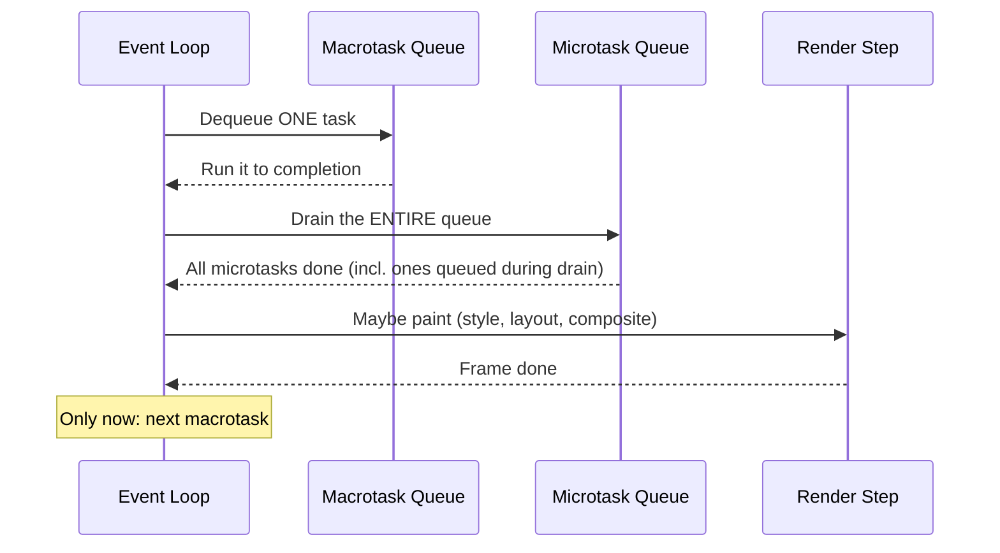
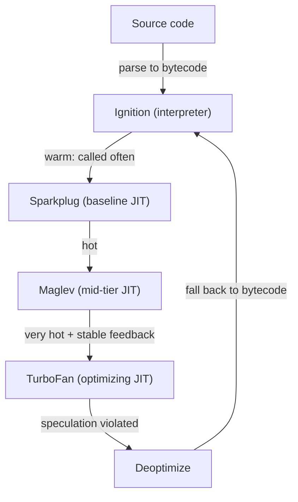
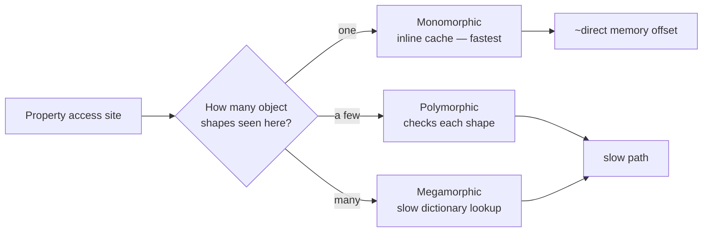

# Module 1: Master JavaScript at the Runtime Level

## 1. The Event Loop & Concurrency Model
Most developers know `setTimeout`, but few understand the exact scheduling order of the event loop. JavaScript is single-threaded, meaning it can only execute one piece of code at a time. The event loop is the mechanism that manages execution order.

### Macrotasks vs. Microtasks
* **Macrotasks (tasks):** Things like `setTimeout`, `setInterval`, I/O, and message events. The engine picks *one* task from the queue, runs it to completion, then drains the microtask queue.
* **Microtasks:** `Promise.then/catch/finally`, [`queueMicrotask`](https://developer.mozilla.org/en-US/docs/Web/API/queueMicrotask), and `MutationObserver` callbacks.
* **The Rule:** After every task (including the initial script), the engine [empties the *entire* microtask queue before the next task](https://html.spec.whatwg.org/multipage/webappapis.html#event-loop-processing-model).

*The event loop: one macrotask, then the entire microtask queue drains, then maybe a paint — only then the next task.*



* **Where rendering fits:** Rendering is **not** a task you dequeue. It's a separate ["update the rendering"](https://html.spec.whatwg.org/multipage/webappapis.html#event-loops) step the browser may run *between* tasks (covered in Module 2). So the real cycle is: run a task → drain microtasks → maybe render → next task.

### Promise Queue Semantics & Starvation
Because the microtask queue is emptied completely, if a microtask recursively queues another microtask, the event loop gets stuck. The browser cannot reach its render step, and tasks (like `setTimeout`) starve.

<SelfTest variant="run">

Predict the exact output, then run it:

```js
console.log("A")
setTimeout(() => console.log("B"))
Promise.resolve().then(() => console.log("C"))
queueMicrotask(() => console.log("D"))
console.log("E")
```

<template #answer>

The output is `A E C D B`. Walk it: the script *is* the first task, so `A` and `E` run synchronously. When the script returns, the engine drains the **entire** microtask queue before any task — `C` then `D`, in enqueue order. Only then does the next task (`setTimeout`) run: `B`. The key insight is that `setTimeout(fn, 0)` does not mean "soon" — it means "after the current task *and* every microtask it spawned."

</template>
</SelfTest>

### async/await Is Just Microtask Sugar
`await` does not block. The engine compiles the function into a **resumable frame** (think generator): hitting `await` suspends the frame and schedules its resumption as a microtask on the awaited promise. Everything after the `await` runs later.

```js
async function f() {
  console.log(1)
  await null  // suspend; resume is queued as a microtask
  console.log(3)
}
console.log(0); f(); console.log(2)
// prints 0, 1, 2, 3
// code after `await` resumes as a microtask, once the stack unwinds
```

`await null` still yields to the microtask queue — [`await` on a non-thenable wraps it via `Promise.resolve`](https://developer.mozilla.org/en-US/docs/Web/JavaScript/Reference/Operators/await). That single fact explains most "why did this run later than I expected" bugs.

## 2. The Memory Model
Understanding where and how variables are stored is critical for writing performant applications.

### Stack vs. Heap
* **Stack:** Stores primitive values (numbers, booleans) and references to objects. It is fast, fixed-size, and automatically cleared when a function returns. Each call pushes a *frame*; blow the limit with unbounded recursion and you get `Maximum call stack size exceeded`.
* **Heap:** Stores objects and functions. It is unstructured, dynamic, and managed by the Garbage Collector (GC).

### Numbers: Two Separate Truths
Two facts often get conflated — keep them apart:

1. **Precision (the language).** Every JS number is an [IEEE-754 float64](https://tc39.es/ecma262/#sec-ecmascript-language-types-number-type). `0.1 + 0.2 !== 0.3` is pure binary-floating-point *rounding* — it has nothing to do with how V8 stores the value.
2. **Storage (the engine).** As an optimization, V8 keeps small integers as **[Smis](https://v8.dev/blog/pointer-compression)** (Small Integers) tagged *inline* in a word — the low bit is a tag marking "this is a Smi, not a pointer," which is *why* the payload loses a bit. They never hit the heap. Drift outside the Smi range, or store a fraction, and V8 boxes the value as a heap-allocated **HeapNumber** — an allocation and an indirection. The Smi payload is **31 bits on 32-bit builds and on 64-bit builds with pointer compression** (the default in modern Chrome/Node), and 32 bits on a 64-bit build without it.

So a counter loop that stays in Smi range allocates nothing; one that drifts into doubles allocates HeapNumbers — a real, measurable cost, *independent* of the `0.1+0.2` rounding issue.

### How GC Actually Works (Generational + Mark-Sweep)
V8's GC is **generational**, built on the observation that most objects die young.
* **Young generation (nursery):** A small space collected by **[scavenging](https://v8.dev/blog/trash-talk)** — a copying collector (Cheney's algorithm) that copies *live* objects to a second semi-space and abandons the rest. Cheap because it only touches survivors. Survive a scavenge or two (V8 actually routes objects nursery → intermediate → old) and you're *promoted* to the old generation.
* **Old generation:** Collected by **mark-sweep-compact** — trace from the roots (stack, globals), mark reachable objects, sweep the rest, occasionally compact to fight fragmentation.
* **Why you feel it:** A major GC that ran fully on the main thread would blow the 16.67ms frame budget. V8's *[Orinoco](https://v8.dev/blog/concurrent-marking)* project makes marking **incremental** and **concurrent** (on background threads) precisely to avoid jank. GC pauses are a real source of dropped frames.

### Closures, Retainers, and Leaks
A closure happens when a function "remembers" its lexical scope even after the outer function has executed.
* **Accidental Memory Leaks:** If a closure retains a reference to a large object (like a DOM node) and that closure is attached to a long-lived object (like a global event listener), the GC cannot free the memory. The retainer chain keeps it reachable.
* **Detached DOM Nodes:** Removing a node from the DOM tree (`element.remove()`) does not free its memory if a JavaScript variable still references it. In a heap snapshot these show up as *Detached HTMLDivElement* — a classic leak.
* **Escape hatches:** [`WeakRef`](https://developer.mozilla.org/en-US/docs/Web/JavaScript/Reference/Global_Objects/WeakRef) holds a reference that *doesn't* prevent collection, and [`FinalizationRegistry`](https://developer.mozilla.org/en-US/docs/Web/JavaScript/Reference/Global_Objects/FinalizationRegistry) lets you run cleanup after collection. Both are tools of last resort — collection timing is non-deterministic.

<SelfTest>

Why does this leak, and what one-word change fixes it?

```js
const cache = new Map()
function remember(node) { cache.set(node, computeExpensiveThing(node)) }
```

<template #answer>

The `Map` holds a *strong* key reference, so every `node` ever passed in stays alive forever — even after it's removed from the DOM. Swap `Map` for `WeakMap`: keys become weakly held, and entries vanish when the node is otherwise unreachable. (This is exactly the structure Vue uses for dependency tracking — see Module 6.)

</template>
</SelfTest>

### Watching the Collector (Without Stopping It)
You can't *control* when V8 collects, but you can *observe* and *measure* — carefully.

* **`FinalizationRegistry` as a GC probe, not a hook:** register an object with a callback and you'll be told *after* it's reclaimed. Useful for detecting leaks ("this cache entry should have been collected and never was") — but the timing is non-deterministic, callbacks may be **coalesced, delayed, or never fire** (e.g. on page teardown), and they run as a separate job. Treat them as observability, never as logic — freeing a socket or releasing a lock in a finalizer is a bug, because "eventually, maybe" is not a guarantee.
* **Measuring the heap:** `performance.measureUserAgentSpecificMemory()` returns a breakdown of your tab's memory (DOM, JS, workers) — but it requires **cross-origin isolation** (the `COOP`/`COEP` headers of Module 16), precisely because a precise memory oracle is a side-channel risk. In DevTools, the three-snapshot technique (Module 3) is still the day-to-day tool for *finding* the retainer chain.
* **Write barriers — why mutation isn't free:** generational GC only works if a young-gen scavenge can run *without* tracing the whole old generation. So V8 keeps a **remembered set** of old→young pointers, and every time you store a young object into an *old* one, a **write barrier** fires to record it. The practical cost: a long-lived cache or store that you constantly mutate to point at fresh objects isn't just allocating — each write pays barrier overhead and grows the set the next minor GC must scan. Steady-state churn in old-gen containers has a price even when nothing is "leaking."

<SelfTest>

You add a `FinalizationRegistry` to close a `WebSocket` "when its wrapper object is collected," and connections sometimes leak for minutes or never close. Why is this the wrong tool, and where should the cleanup live?

<template #answer>

Finalizer timing is non-deterministic — V8 may delay or skip the callback entirely, and it certainly won't run promptly, so a resource whose release matters can stay open indefinitely. Deterministic cleanup belongs in explicit lifecycle code: a `close()`/`dispose()` method, `try/finally`, or a framework unmount hook. `FinalizationRegistry` is for *detecting* that something wasn't cleaned up, not for doing the cleanup.

</template>
</SelfTest>

## 3. JavaScript Engine Internals (V8)
JavaScript engines don't simply "interpret" or "compile" — they do both, in tiers, and move hot code up the tiers at runtime.

### The Tiered Pipeline
1. **[Ignition](https://v8.dev/blog/ignition-interpreter)** — a bytecode interpreter. Source is parsed to an AST, then compiled to compact bytecode and interpreted. Fast to start, slow to run.
2. **[Sparkplug](https://v8.dev/blog/sparkplug)** — a non-optimizing *baseline* compiler that turns bytecode straight into machine code with no IR. Cheap to produce; removes interpreter overhead.
3. **[Maglev](https://v8.dev/blog/maglev)** — a mid-tier optimizing compiler (newer) that produces decent code quickly using feedback, bridging the gap to TurboFan.
4. **[TurboFan](https://v8.dev/docs/turbofan)** — the top-tier optimizing compiler. It speculates based on observed types and emits highly optimized machine code.

Code that runs often gets promoted; if TurboFan's speculative assumptions are later violated, the function is **deoptimized** back down to Ignition bytecode (and can be re-optimized later via on-stack replacement once it stabilizes).

*Hot code climbs the tiers; a broken speculation deoptimizes it straight back to bytecode.*




### Hidden Classes & Inline Caching
* **[Hidden Classes (Shapes/Maps)](https://v8.dev/blog/fast-properties):** V8 creates internal "shapes" for objects to optimize property access. If `objA` and `objB` have the same properties added in the *exact same order*, they share a hidden class — and code that touches them stays fast.
* **[Inline Caching (IC)](https://v8.dev/docs/hidden-classes):** At each property-access site, the engine caches *where* the property lives for the shapes it has seen. Same shape every time (**monomorphic**) → near-direct memory access. A handful of shapes → **polymorphic**. Many shapes → **megamorphic** → fall back to a slow dictionary lookup.
* **Deoptimization:** Dynamically adding/deleting properties, or initializing object fields in different orders, mints new shapes, busts the IC, and can force V8 to bail TurboFan's optimized code. The practical rule: **initialize all fields in the constructor, in a consistent order, and don't `delete`.**

*Stable object shapes keep a call site monomorphic — the fast path; shape variety degrades it toward a dictionary lookup.*



<SelfTest>

Without reading ahead, predict which loop produces faster property reads *downstream*, and explain why in terms of hidden classes:

```js
// A
for (let i = 0; i < N; i++) pts.push({ x: i, y: i })
// B
for (let i = 0; i < N; i++) pts.push(i % 2 ? { x: i, y: i } : { y: i, x: i })
```

<template #answer>

A. The branch in B creates two different property-insertion orders → two hidden classes → any later `p.x` read site sees both shapes and goes polymorphic, losing the monomorphic fast path. Same fields, different order, real cost.

</template>
</SelfTest>

## 4. The Prototype System
JavaScript does not have traditional classes under the hood; it relies on objects linking to other objects via prototypes.

### Property Resolution & Proxies
* **Prototype Chain Lookup:** When accessing `obj.prop`, the engine checks `obj`. If not found, it checks `obj`'s prototype, and so on up the chain until it hits `null`. Longer chains mean more lookups — but the IC caches resolved positions, including ones found on the prototype:

```js
// greet lives on Base.prototype, not on each instance
class Base { greet() { return "hi" } }
class User extends Base {}
const u = new User()
// missed on `u`, resolved on Base.prototype. The IC caches that
// location by u's shape, so repeat calls skip the chain walk.
u.greet()
```

Add `greet` directly onto some instances but not others and you mint extra shapes — the call site goes polymorphic and the cached prototype lookup is lost. Prototype methods are fast *because* shapes stay stable.

* **Getters, Setters, and Proxies:** Modern frameworks (like Vue.js) rely on [`Proxy`](https://developer.mozilla.org/en-US/docs/Web/JavaScript/Reference/Global_Objects/Proxy) to intercept object operations (`get`, `set`, `has`, `deleteProperty`). This is what lets the framework automatically track dependencies and trigger UI updates whenever reactive state changes — the mechanism dissected in Module 5.

<SelfTest>

A `Proxy`'s `get` trap fires on *every* read. What does that imply for the cost of a deeply nested reactive object that you read in a hot loop — and why does Vue 3 make reactivity *lazy* (only proxying nested objects when you actually access them)?

<template #answer>

Each property hop runs trap code instead of a raw load, so reading `a.b.c.d` in a loop multiplies trap overhead by depth × iterations — cache the leaf in a local. Lazy proxying means Vue pays to wrap a nested object only the first time you touch it, so a large state tree you never read costs nothing.

</template>
</SelfTest>