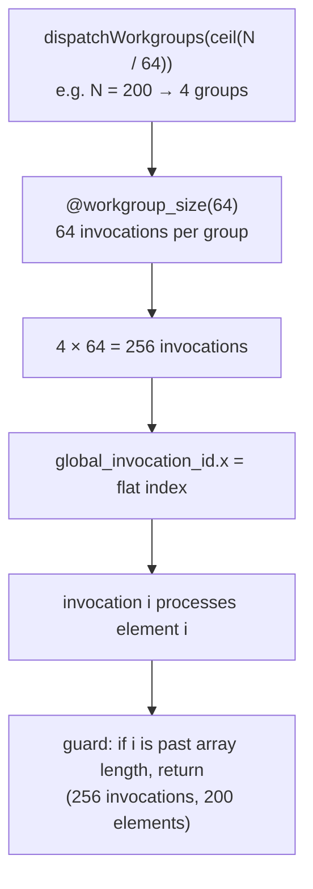
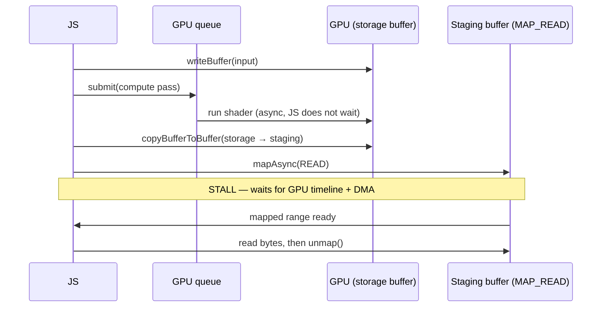

# Module 14: WebGPU & Compute Shaders

Modules 10 and 13 got work off the main thread (Workers) and out of JavaScript (Wasm), but it all still ran on the **CPU** — a handful of fast, general cores. The GPU is a different machine entirely: thousands of narrow lanes that run the *same* instruction over *different* data. WebGPU is the platform's first low-level, compute-capable door to it. This module is about using it **without drawing anything** — pure parallel math via compute shaders.

## 1. Why the GPU (and When It Loses)
A CPU core is a sprinter: deep pipelines, branch prediction, big caches, optimized for one sequential thread going fast. A GPU is a phalanx: it executes in **SIMT** style (Single Instruction, Multiple Threads) — lanes are grouped (a *warp*/*wave*, typically 32) and the whole group advances in lockstep on one instruction.

* **What this buys you:** if you have a million independent elements and the same arithmetic to apply to each, the GPU does them in massive parallel batches. This is the sweet spot — particle systems, physics integration, image kernels, matrix math, large-array reductions.
* **What kills it — divergence:** because a wave shares one program counter, an `if` that sends some lanes one way and some the other forces the hardware to run *both* branches with the inactive lanes masked off. Branchy, data-dependent code serializes and wastes lanes. The GPU punishes exactly the control flow the CPU's branch predictor was built to love.
* **The other tax — the bus:** the GPU has its own memory. Getting data there and (especially) back crosses a boundary even more expensive than JS↔Wasm (§5). The GPU only wins when *compute per byte transferred* is high.

> **Self-Test:**
> You move a function over a 10-million-element `Float32Array` to a WebGPU compute shader and it's *slower* than a plain JS loop. The function is `out[i] = Math.sqrt(in[i])`. What two costs likely swamped the win, and what property of the workload made this a bad GPU candidate? *(Upload of the input buffer + readback of the output buffer dominate, because the compute per element — a single sqrt — is trivial. Low arithmetic intensity (work per byte moved) is the tell: the GPU is starved by transfer, not compute. It pays off when each element does a lot of math, or when the data already lives on the GPU and never comes back.)*

## 2. The Device Pipeline: adapter → device → queue
You don't just "call the GPU." You negotiate access to it, and every step is async because it may involve the OS driver, another process (the GPU process), or hardware that can vanish.

```js
if (!navigator.gpu) throw new Error("WebGPU unavailable")

const adapter = await navigator.gpu.requestAdapter()   // pick a physical GPU + its limits
const device  = await adapter.requestDevice()          // a logical handle + its own resources
const queue   = device.queue                            // where you submit work
```

* **Adapter** — a handle to a physical GPU (or a software fallback) and the **limits/features** it advertises (max buffer size, max workgroup size, whether it supports `timestamp-query`, etc.). You can request a `powerPreference` (`"high-performance"` vs `"low-power"`).
* **Device** — the logical connection you actually allocate resources against. It's isolated: a `device.lost` promise rejects if the driver resets or the tab is backgrounded, and you must recreate everything. Treat device loss as expected, not exceptional.
* **Queue** — the single ordered channel you push commands and buffer writes into. Work is **recorded** into command buffers and **submitted** to the queue; it executes asynchronously on the GPU timeline, not the JS one.

The whole API is **retained-mode and validated up front**: you build immutable pipeline/layout objects once, then cheaply replay commands against them each frame. The expensive validation happens at creation, not per dispatch.

## 3. Buffers & Bind Groups: getting data in
GPU memory is not your `ArrayBuffer`. You allocate a `GPUBuffer`, declare what it's *for* with usage flags, and copy into it.

```js
// input data living in JS
const input = new Float32Array([1, 2, 3, 4, 5, 6, 7, 8])

// a buffer the shader can read/write, and that we can copy *out of* later
const storage = device.createBuffer({
  size: input.byteLength,
  usage: GPUBufferUsage.STORAGE | GPUBufferUsage.COPY_SRC | GPUBufferUsage.COPY_DST,
})
device.queue.writeBuffer(storage, 0, input)   // the upload (CPU -> GPU memory)
```

* **Usage flags are a contract.** A buffer must declare every role it will play (`STORAGE`, `UNIFORM`, `COPY_SRC`, `COPY_DST`, `MAP_READ`…). The driver places it in the right memory and the validator rejects illegal uses. Critically, a buffer that is `STORAGE` **cannot also be `MAP_READ`** — that restriction is the whole reason readback needs a second buffer (§5).
* **Bind groups wire buffers to shader slots.** A shader declares numbered binding points; a `GPUBindGroupLayout` describes their types; a `GPUBindGroup` binds concrete buffers to them. This indirection is what lets you swap data between dispatches without recompiling the pipeline.

```js
const bindGroup = device.createBindGroup({
  layout: pipeline.getBindGroupLayout(0),
  entries: [{ binding: 0, resource: { buffer: storage } }],
})
```

## 4. Compute Shaders in WGSL: the actual parallel program
The kernel is written in **WGSL** (WebGPU Shading Language) and compiled by the driver. A *compute* shader has no pixels and no vertices — it's just a function the GPU runs across a grid of invocations.

```rust
// double.wgsl — runs once per element, in parallel
@group(0) @binding(0) var<storage, read_write> data: array<f32>;

@compute @workgroup_size(64)
fn main(@builtin(global_invocation_id) gid: vec3<u32>) {
  let i = gid.x;
  if (i >= arrayLength(&data)) { return; }   // guard the tail (see §below)
  data[i] = data[i] * 2.0;
}
```

The mental model is a **3D grid of invocations**, organized in two levels:

* **Workgroup** — a fixed-size block of invocations (`@workgroup_size(64)` = 64 lanes) that run together and can share fast on-chip `var<workgroup>` memory and synchronize with `workgroupBarrier()`. This is your unit of cooperation.
* **Dispatch** — how many workgroups to launch, set from JS by `dispatchWorkgroups(x, y, z)`.
* **`global_invocation_id`** — each invocation's unique coordinate in the whole grid; `gid.x` is the flat index you use to address your array.

So **total invocations = workgroup_size × number of workgroups**. To cover N elements with `@workgroup_size(64)`, you dispatch `ceil(N / 64)` workgroups — which usually overshoots N, hence the `if (i >= arrayLength) return` tail guard.

*Dispatch count times workgroup size sets the invocation grid; the flat global_invocation_id maps each invocation to one array element.*



```js
const module = device.createShaderModule({ code: wgsl })
const pipeline = device.createComputePipeline({
  layout: "auto",
  compute: { module, entryPoint: "main" },
})

const encoder = device.createCommandEncoder()
const pass = encoder.beginComputePass()
pass.setPipeline(pipeline)
pass.setBindGroup(0, bindGroup)
pass.dispatchWorkgroups(Math.ceil(input.length / 64))   // NOT input.length!
pass.end()
device.queue.submit([encoder.finish()])
```

> **Self-Test:**
> A colleague writes `pass.dispatchWorkgroups(input.length)` with `@workgroup_size(64)` and the program is correct but ~64× slower than expected, and only the first element looks right. What did they confuse, and what's the fix? *(They dispatched one **workgroup per element**, launching `64 × input.length` invocations — 64× the work — while every invocation computed the same `gid.x` range per group, so most writes are redundant/wrong. `dispatchWorkgroups` takes the number of **workgroups**, not invocations: dispatch `Math.ceil(input.length / 64)`, and address elements via `global_invocation_id.x`.)*

## 5. The Readback Wall: getting data out
This is where naïve WebGPU compute dies. You **cannot** read a `STORAGE` buffer from JS directly — a storage buffer can't be `MAP_READ`. You must copy it into a second, mappable **staging buffer**, then map *that*.

```js
const readback = device.createBuffer({
  size: input.byteLength,
  usage: GPUBufferUsage.COPY_DST | GPUBufferUsage.MAP_READ,   // mappable, but can't be STORAGE
})

// after the compute pass, before submit:
encoder.copyBufferToBuffer(storage, 0, readback, 0, input.byteLength)
device.queue.submit([encoder.finish()])

await readback.mapAsync(GPUMapMode.READ)        // wait for the GPU to finish + DMA back
const result = new Float32Array(readback.getMappedRange().slice(0))  // copy out of the mapping
readback.unmap()
```

Count the round trip: **upload** (`writeBuffer`) → **compute** → **GPU-to-GPU copy** (`copyBufferToBuffer`) → **submit** → `mapAsync` stalls until the GPU timeline catches up and the data is DMA'd to mappable memory → **copy out** of the mapped range. The `mapAsync` await is the killer: it forces a synchronization point between the asynchronous GPU timeline and your JS event loop (Module 1). For a one-shot small computation, this latency dwarfs the math. WebGPU compute pays off when the data **stays resident** on the GPU across many passes and only rarely comes back — a physics simulation stepping 60×/sec on-GPU, reading back only what it must draw.

*Compute is async and effectively free; the mapAsync read-back is where the CPU stalls waiting for the GPU timeline.*



> **Self-Test:**
> Why does `mapAsync` return a *promise*, and what would go wrong if WebGPU let you read the storage buffer synchronously right after `submit()`? *(GPU work runs on its own timeline asynchronously; at the instant `submit()` returns, the compute almost certainly hasn't run yet. A synchronous read would either return stale/garbage memory or force a full pipeline stall blocking the main thread. `mapAsync` resolves only once the GPU has finished the work and the results are visible to the CPU, keeping the JS thread free in the meantime — the same "don't block the one thread" discipline as the rest of the platform.)*

## 6. When to Reach for It
You now have three escalating ways to move work off the JS main thread. Pick by the *shape* of the work, not by novelty:

| Tool | Best when | Worst when |
| :--- | :--- | :--- |
| **Web Workers** (M10) | Coarse parallel tasks, keeping the UI thread free; modest data via transferables | Per-task data is huge and copied each time |
| **Wasm (+SIMD)** (M13) | CPU-bound, branchy or sequential logic; near-native single-thread throughput | The boundary is crossed in tiny chunks |
| **WebGPU compute** | *Massively* data-parallel, high arithmetic intensity, data that stays on-GPU | Small jobs, divergent control flow, or results needed back on the CPU immediately |

The decision rule that ties the tier together: **WebGPU wins on arithmetic intensity (math per byte moved) and loses on transfer and divergence.** A particle system that lives on the GPU and is drawn from the same buffers is the canonical win; a single pass over an array you immediately read back is usually a Wasm or even plain-JS job.

> **Self-Test:**
> You're building a 100k-particle simulation at 60fps. Why is "simulate on the GPU and render from the same buffers" categorically better than "simulate in a Web Worker and upload positions each frame" — even if the per-particle math is identical? *(The Worker version pays an upload of all 100k positions every frame across the CPU→GPU bus, plus serialization to/from the worker; the data round-trips constantly. The GPU version keeps positions resident in GPU buffers and the render pass reads the *same* buffers the compute pass wrote — zero readback, zero per-frame upload. Arithmetic intensity stays high because the data never leaves the device. This residency, not raw FLOPS, is usually what decides GPU vs CPU.)*
