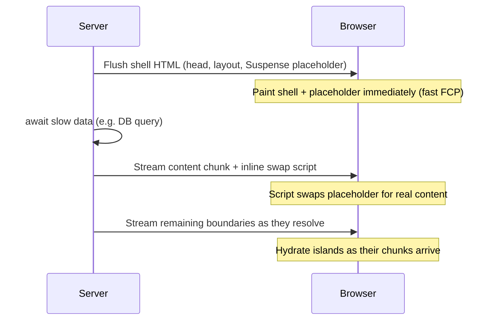

# Module 15: Edge Runtimes & Streaming

Frontend execution no longer stops at the browser. It extends to the **edge** — code that runs in hundreds of points-of-presence physically near the user, deciding and rendering before a request ever reaches an origin server. But "serverless at the edge" is built on a different runtime model than the Node you know, and that model dictates how you stream a page back. This module connects the two: *where* edge code runs, and *how* its output reaches the browser progressively.

## 1. Isolates vs Processes: Why the Edge Isn't Node
A traditional server (or a Lambda) gives each tenant an **OS process**: its own memory space, its own copy of the runtime, started by booting a container. That isolation is strong but heavy — hundreds of milliseconds to spin up, tens of MB of baseline memory each. At the edge, where you want thousands of tenants per machine and a cold start on *every* request to a cold POP, that model collapses.

Edge runtimes (Cloudflare Workers, Deno Deploy, Vercel Edge) instead use **V8 isolates** — the same isolation primitive a browser uses to separate tabs. An isolate is a sandboxed instance of the V8 engine *within a single shared process*:

* **Cold start in ~milliseconds, not hundreds.** The runtime process is already warm; spinning up an isolate is allocating a fresh heap and JS context, often restored from a **[V8 snapshot](https://v8.dev/blog/custom-startup-snapshots)** (a pre-initialized heap image) rather than re-parsing and re-executing your code. There's no OS process to fork, no container image to boot.
* **Kilobytes, not megabytes, of overhead.** Thousands of isolates share one runtime, so a single machine packs far more tenants — the density that makes per-request isolation economical.
* **Memory-safe separation without a process boundary.** V8 enforces that one isolate can't read another's heap. The tradeoff: you inherit V8's limits, and you do *not* get a full OS.

> **Self-Test:**
> A Lambda and a Cloudflare Worker both run "the same" JS handler. The Worker cold-starts in ~5ms and the Lambda in ~200ms+. What structural difference accounts for two orders of magnitude — and what does the Worker give up to get it? *(The Lambda boots a container/microVM with its own OS and Node process per cold start; the Worker spins up a V8 isolate inside an already-running process, often from a heap snapshot — no OS, no process fork, no runtime re-init. The Worker gives up the full Node API and native modules: no `fs`, no arbitrary binaries, no threads — only what the sandboxed runtime exposes.)*

## 2. The Constraint Surface
Choosing isolates over processes isn't free — it defines what your code *can't* do. Designing for the edge is designing within these walls:

* **No filesystem, no native addons, no child processes.** There's no OS to expose. Code that does `fs.readFile`, spawns a binary, or imports a native `.node` module simply won't run. Assets come from bindings (KV, R2, D1) or fetch, not disk.
* **Web-standard APIs, not the Node standard library.** The runtime exposes `fetch`, `Request`/`Response`, `ReadableStream`/`WritableStream` (Module 4), `URL`, `TextEncoder`, **Web Crypto** (`crypto.subtle`) — the same surface as a browser and a Service Worker (Module 4). This is deliberate: the same code can often run in a browser, a Worker, and at the edge. Node-only globals (`Buffer`, `process`, `__dirname`) are absent or shimmed.
* **CPU-time limits, not wall-clock.** Platforms cap **CPU time** per request (often tens of ms), but `await`ing a slow `fetch` doesn't burn CPU — the isolate yields the single thread (Module 1) while waiting. So I/O-bound fan-out is fine; a tight 200ms compute loop gets killed. The event-loop model you learned in Module 1 *is* the scheduling model here.
* **Statelessness by default.** Isolates are evicted aggressively and your code may run in a different POP next request. In-memory state is a cache at best; durable state lives in a binding (Durable Objects, KV) — which is exactly the "single source of truth" discipline from Module 12.

The mental shift: the edge is not "Node, closer." It's "a browser-like sandbox, on the server, with bindings instead of a disk."

## 3. Chunked Transfer Encoding: How a Response Streams
To stream a page from the edge you need to send bytes *before you know the total length*. HTTP's mechanism for that predates HTTP/2 — it's plain **[chunked transfer encoding](https://www.rfc-editor.org/rfc/rfc9112#name-chunked-transfer-coding)** from HTTP/1.1.

Normally a response carries `Content-Length: N` and the browser waits for a complete body. With `Transfer-Encoding: chunked`, the server omits the length and instead writes a sequence of **size-prefixed chunks**, terminated by a zero-length chunk:

```
HTTP/1.1 200 OK
Content-Type: text/html
Transfer-Encoding: chunked

1b
<!doctype html><title>App</title>
2a
<div id="root"><header>…shell…</header>
0

```

Each chunk is `<hex length>\r\n<bytes>\r\n`; the final `0\r\n\r\n` ends the body. The browser parses and renders chunks **as they arrive** — so it can paint the header while the server is still computing the rest. (HTTP/2 and /3 drop the textual framing for binary `DATA` frames over a multiplexed stream, but the streaming *semantics* are identical: a body delivered incrementally.) On the runtime side you don't hand-write chunks — you return a `Response` whose body is a `ReadableStream` (Module 4), and the runtime frames it:

```js
export default {
  async fetch(request) {
    const stream = new ReadableStream({
      async start(controller) {
        const enc = new TextEncoder()
        controller.enqueue(enc.encode("<!doctype html><div id=root>"))
        controller.enqueue(enc.encode("<header>…shell…</header>"))  // flush early
        const data = await slowQuery()                               // keep streaming
        controller.enqueue(enc.encode(renderList(data)))
        controller.enqueue(enc.encode("</div>"))
        controller.close()
      },
    })
    return new Response(stream, { headers: { "content-type": "text/html" } })
  },
}
```

> **Self-Test:**
> A page's TTFB (time to first byte) is great but the user still stares at a blank screen for 800ms. The server sends `Content-Length` and builds the whole HTML string before responding. How does switching to chunked streaming change *what the user sees first*, and why doesn't a faster TTFB alone fix the blank screen? *(With a buffered `Content-Length` response, "first byte" can arrive quickly but the **body** isn't sent until the entire HTML is built — the browser has nothing to paint for 800ms. Chunked encoding lets the server flush the `<head>` and shell immediately and stream the slow part later, so the browser paints meaningful content while the server still works. TTFB measures when bytes start; perceived load depends on when *renderable* bytes arrive — streaming targets the second.)*

## 4. Streaming SSR: Flush the Shell, Stream the Rest
Server-side rendering used to be all-or-nothing: run the whole component tree to an HTML string, then send it. One slow data dependency held the *entire* page hostage. **Streaming SSR** breaks the page into a fast **shell** and slower **boundaries**.

* The renderer emits the shell (layout, nav, anything with no pending data) into the first chunks immediately.
* Where a subtree is waiting on data, it emits a **placeholder** (fallback UI) and keeps the connection open.
* When that data resolves on the server, it streams the real markup for that subtree in a later chunk, plus a tiny inline script that swaps the placeholder for the content in place.

*Flush the shell immediately for a fast first paint, then stream each Suspense boundary's content as its data resolves.*



In React this maps onto **`<Suspense>` boundaries**: each boundary is a flush point. `renderToReadableStream` (the Web-streams API used by edge runtimes) produces exactly the `ReadableStream` you return from §3. The shell is interactive via **selective hydration** — React hydrates ready boundaries without waiting for the whole tree, and prioritizes the one the user interacts with first.

```jsx
<Layout>
  <Nav />                         {/* in the shell — flushed first */}
  <Suspense fallback={<Spinner/>}>
    <SlowFeed />                  {/* placeholder now, real markup streamed later */}
  </Suspense>
</Layout>
```

The win is the same as §3, structured: meaningful paint and interactivity track the *fast* parts of the page, not the slowest data dependency.

## 5. React Server Components: Serializing the UI Tree
Streaming SSR streams **HTML**. React Server Components (RSC) stream something more interesting: a **serialized representation of the rendered React tree itself**.

A Server Component runs *only on the server* — it can touch the database or filesystem-equivalent bindings, and it **never ships to the client as code**. What crosses the wire is its *output*: not HTML, and not the component function, but a compact, line-delimited **RSC payload** describing the rendered element tree — host elements, props, text, and **references** to the Client Components that still need JS.

* **Server Components** → reduced to data in the payload. Their source never enters the bundle, so heavy server-only dependencies cost the client zero bytes.
* **Client Components** (marked `"use client"`) → appear in the payload as a *reference* (a module id) plus their serialized props. The browser loads only those modules and hydrates only those islands.
* **The payload streams.** Like §4, it's emitted progressively as server subtrees resolve; React on the client reconstructs the element tree incrementally and reconciles (Module 5) rather than re-parsing HTML.

The reason this is a *serialization* problem, not a rendering one: the boundary between "ran on the server, now inert data" and "must run on the client, ship the code" has to be encoded in the stream itself. Props passed from a Server to a Client Component must be serializable — you can't send a function or a class instance across that line, only data. That single constraint is the whole RSC mental model.

> **Self-Test:**
> You import a 300KB markdown-parsing library and use it inside a Server Component to render a post. The client bundle doesn't grow at all. Where did the library "go," and what exactly traveled to the browser instead? *(The library ran on the server during render; its code was never added to the client bundle. What traveled was the **RSC payload** — the serialized result of rendering (the resulting element tree: tags, text, props) — not the parser or the markdown source. The browser reconstructs UI from that data. Only components marked `"use client"` ship their code; a Server Component contributes data, not JavaScript.)*

## 6. Putting It Together: Render at the Edge, Stream to the Client
The pieces compose into one request path:

1. A request hits the nearest POP; a **V8 isolate** cold-starts in milliseconds (§1) and runs your handler under a CPU-time budget (§2).
2. The handler renders a component tree to a **`ReadableStream`** (§4/§5), flushing the shell into the first **chunks** (§3) while awaiting slow data — the awaits yield the thread, not burn CPU (§2).
3. The browser paints the shell on the first chunks and hydrates interactive islands as their markup/payload arrives.

The latency win is real: compute near the user, and overlap server work with client rendering instead of serializing them. The failure modes are just as real:

* **Over-granular flushing.** Too many tiny Suspense boundaries means many round-trips of fallback-then-content swaps, layout shift, and overhead that can feel *worse* than one well-placed boundary. Stream at meaningful seams, not every node.
* **CPU-bound work at the edge.** A heavy render or parse blows the CPU-time cap (§2). Push genuinely heavy compute to Wasm (Module 13), a GPU tier (Module 14), or an origin service — the edge is for fast decisions and orchestration, not number-crunching.
* **Reaching for missing APIs.** Edge ≠ Node; code assuming `fs`/`Buffer` breaks (§2).

> **Self-Test:**
> A team wraps *every* component on the page in its own `<Suspense>` boundary "to stream as much as possible," and the page feels janky and slow despite streaming. Why can more boundaries hurt — and what's the principle for placing them? *(Each boundary is a flush point: a fallback rendered, then a content chunk + an inline swap script, then a possible layout shift and a hydration step. Dozens of them mean constant placeholder churn, cumulative layout shift, and per-boundary overhead that outweighs the parallelism. Place boundaries at meaningful content seams — where a genuinely slow data dependency would otherwise block the page — not around every node. The goal is to isolate the slow part, not to maximize chunk count.)*
