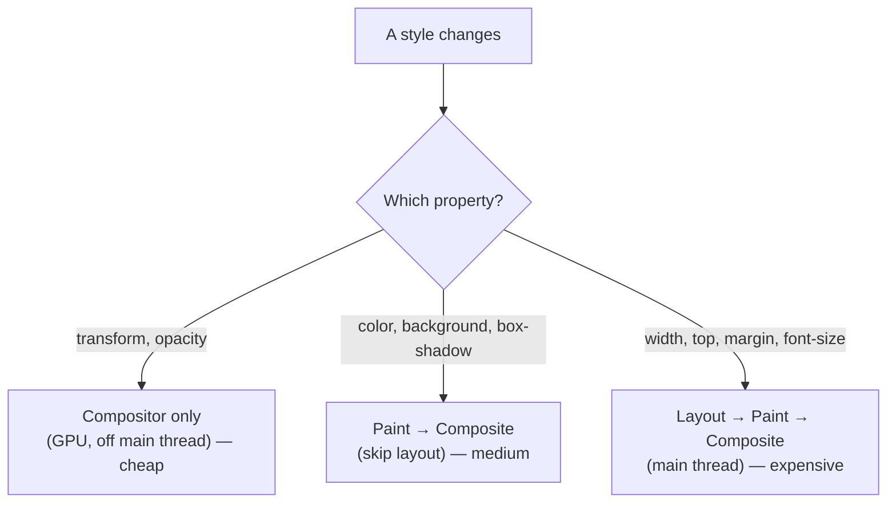
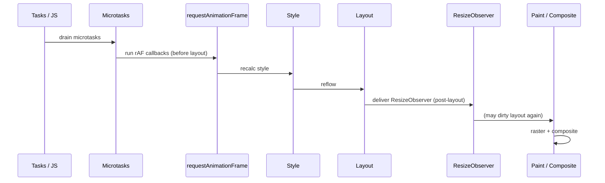

# Module 2: Understand the Browser Like an Operating System

To write high-performance applications, you must know what the browser is doing every millisecond. The browser is not just a document viewer; it is a multi-process operating system that schedules work, isolates memory, and arbitrates the GPU.

## 1. Multi-Process Architecture
A modern browser is many processes, not one. This is the part of "browser as an OS" most developers never internalize.

* **Browser process:** The privileged coordinator — UI (tabs, address bar), and access to disk/network/devices.
* **Renderer process:** Runs your page — HTML/CSS/JS, layout, paint. Under **[Site Isolation](https://www.chromium.org/Home/chromium-security/site-isolation/)**, each *site* gets its own sandboxed renderer (Chrome's default is process-per-*site-instance*: same-site frames may share one, cross-site iframes get their own out-of-process renderer). Note *site* means the registrable domain ([eTLD+1](https://developer.mozilla.org/en-US/docs/Glossary/Site), e.g. `example.com`), which is **coarser than origin** (scheme + host + port) — the boundary seniors most often get wrong. The sandbox stops a compromised page from reading another site's memory — the Spectre-era mitigation.
* **GPU process:** A single shared process that talks to the actual GPU and composites layers from all renderers.
* **Network & utility processes:** Fetching, decoding, etc.

The consequence: your JavaScript runs in *one* sandboxed renderer with *one* main thread. A `while(true)` hangs that tab — not the browser. And the "main thread" you keep hearing about is the renderer's main thread, the same one that runs layout and paint. Everything competes for it.

## 2. The Rendering Pipeline
Every time a page loads or updates, it converts code into pixels through a strict sequence — the **[pixel pipeline](https://web.dev/articles/rendering-performance)**.

*Every frame flows one way — DOM and CSSOM through layout and paint to a GPU composite.*


* **DOM Construction:** Parse HTML into a tree of nodes (Document Object Model).
* **CSSOM Construction:** Parse CSS into a tree (CSS Object Model). CSS is **[render-blocking](https://web.dev/articles/render-blocking-css)** (the browser won't paint until the CSSOM is ready) but **not parser-blocking** — HTML parsing continues. The catch: a `<script>` must wait for in-flight CSS, because the script might read computed styles, so **CSSOM blocks JS execution**. (Only scripts block the HTML parser.)
* **Style:** Match selectors to nodes and compute the final value of every property. Costly with huge stylesheets or expensive selectors; invalidation here can cascade.
* **[Layout (Reflow)](https://developer.mozilla.org/en-US/docs/Glossary/Reflow):** Compute the exact geometry (position and size) of every visible element. Geometry-affecting changes invalidate this.
* **Paint:** Record draw operations (colors, text, borders, shadows) into a **display list** — instructions, not pixels yet. The browser tracks *invalidation regions* so it can re-record only the part that changed.
* **Raster + Composite:** **Rasterize** the display list into bitmap **tiles** (often on the GPU), then the **compositor** assembles layers in stacking order into the final frame. Recording (paint) and rasterizing are separate costs — a layer can be re-rastered without being re-recorded.

## 3. GPU Compositing & Hardware Acceleration
Not all CSS changes cost the same — what matters is *how far down the pipeline* a change forces the browser to re-run.

*Where a property change re-enters the pipeline decides its cost — compositor-only is cheap, layout-triggering is not.*



* **Main thread vs. compositor thread:** Style, Layout, and Paint happen on the main thread. Compositing happens on the **[compositor thread](https://web.dev/articles/rendering-performance)** with the GPU — so it keeps running even when the main thread is busy (which is why a janky page can still scroll smoothly if scrolling is compositor-driven).
* **`transform` / `opacity`:** Animating these touches *only* the compositor. The layer is already painted; the GPU just re-positions or fades it. Cheap, off-main-thread.
* **`top` / `left` / `width` / `height`:** These change geometry → re-run **Layout → Paint → Composite** every frame. Expensive.
* **Layers cost memory:** Promoting an element to its own compositor layer (via [`will-change: transform`](https://developer.mozilla.org/en-US/docs/Web/CSS/will-change), `transform: translateZ(0)`, etc.) lets the GPU move it for free — but each layer eats GPU memory. "Layer explosion" (promoting hundreds of elements) trades one problem for another.
* **Containment:** [`contain: layout`](https://developer.mozilla.org/en-US/docs/Web/CSS/contain) and [`content-visibility: auto`](https://developer.mozilla.org/en-US/docs/Web/CSS/content-visibility) let you tell the browser a subtree's layout/paint is independent or can be skipped entirely when off-screen — bounding invalidation so one change doesn't re-lay-out the whole document.

<SelfTest>

Why is `transform: translateX(100px)` fast but `left: 100px` slow?

<template #answer>

Because `transform` is a compositor-only property (skip Layout and Paint), while `left` is a layout property that re-runs the whole pipeline. Animate position with `transform`, not `left`/`top`.

</template>
</SelfTest>

## 4. The Critical Rendering Path & Parsing
Pixels can't appear until code arrives and parses. How you load scripts dictates when the engine can start.

* **Parser-blocking scripts:** A plain `<script>` stops HTML parsing until it downloads *and* executes — because the script might synchronously inject markup into the document stream. This is why scripts traditionally go at the end of `<body>`.
* **`defer`:** Download in parallel, execute in order *after* the DOM is parsed. The right default for app code.
* **`async`:** Download in parallel, execute *as soon as it lands*, unordered. For independent third-party scripts.
* **Preload scanner:** A secondary parser that races ahead of the main parser to discover and fetch ``, `<script>`, and stylesheets early — even while the main parser is blocked. This is why injecting resources via JS can be *slower* than putting them in the HTML: the scanner never sees them.

## 5. Scheduling, Frame Budgets & Responsiveness
Smooth animation runs at the display's refresh rate — typically 60 FPS.

* **The 16.67ms budget:** 1s / 60 = 16.67ms. Within that window the browser must run pending JS, recalc style, lay out, paint, and composite. Overrun and you **drop a frame** (jank).
* **The "update the rendering" step:** Microtasks drain after *every* task and *every* callback — not once per frame. Periodically, between tasks, the browser runs its render step. The ordering has a subtlety worth getting right: [`requestAnimationFrame`](https://developer.mozilla.org/en-US/docs/Web/API/Window/requestAnimationFrame) callbacks run *first*, then style and layout — and **`ResizeObserver` is delivered *after* layout** (it observes the just-computed sizes), so a resize callback that mutates layout can force another layout pass, looping within the frame. `IntersectionObserver` delivery is queued separately, post-render. The takeaway that matters: **`rAF` runs just before style/layout**, so it's the correct place to batch DOM writes into the upcoming frame.

*requestAnimationFrame runs before style and layout; ResizeObserver delivers after — that ordering is the whole game.*



* **`requestAnimationFrame`:** Run a callback right before the next render. For visual updates.
* **[`requestIdleCallback`](https://developer.mozilla.org/en-US/docs/Web/API/Window/requestIdleCallback):** Run during idle time. For non-urgent work (analytics, prefetch) — but it yields the instant the browser has frame work to do.
* **Long tasks vs. INP — two different things:** A task over 50ms is a **Long Task** (the [Long Tasks API](https://developer.mozilla.org/en-US/docs/Web/API/PerformanceLongTaskTiming) threshold) that monopolizes the main thread. **INP** (Interaction to Next Paint) measures the *latency of a specific interaction*, regardless of long-task count — though long tasks are a common cause of bad INP. The fix is **yielding**: break long work into chunks and hand control back ([`await scheduler.yield()`](https://developer.mozilla.org/en-US/docs/Web/API/Scheduler/yield) — Chromium-only as of writing, and it resumes at the task's original priority — or chunking with `scheduler.postTask()` priorities) so input can interleave.

## 6. Performance Profiling
Guessing about performance is a trap. Measure.

* **Performance panel:** Record the main thread; read the **flame chart** (wide bars = slow functions, top-down = call depth).
* **Forced Synchronous Layout (layout thrashing):** Reading a geometry property (`offsetHeight`, [`getBoundingClientRect`](https://developer.mozilla.org/en-US/docs/Web/API/Element/getBoundingClientRect), `scrollTop`) *forces* the browser to flush a pending layout synchronously so it can answer you. Interleaving reads and writes in a loop produces read→layout→write→invalidate→read→layout… — quadratic layout work.

```js
// SLOW: each read forces a layout flush that the previous
// write just invalidated — N layouts
for (const el of items) {
  el.style.width = el.previousElementSibling.offsetWidth + "px"
}

// FAST: one read pass (one layout), then one write pass
const widths = items.map(
  (el) => el.previousElementSibling.offsetWidth   // read
)
items.forEach((el, i) => {
  el.style.width = widths[i] + "px"               // write
})
```

<SelfTest>

Why is `el.style.width = "100px"; console.log(el.offsetWidth)` expensive, and why does the FAST version above turn N layouts into 1?

<template #answer>

The write invalidates layout; the immediate read forces a synchronous reflow to answer with fresh geometry. Batching all reads first lets the browser satisfy them from a single layout pass, then all writes invalidate once. This read-then-write split is the single most reusable rendering-performance pattern.

</template>
</SelfTest>