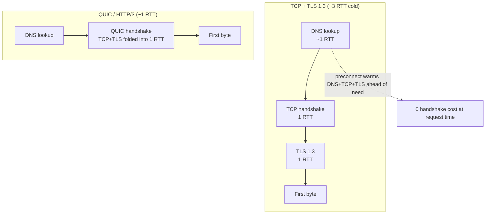
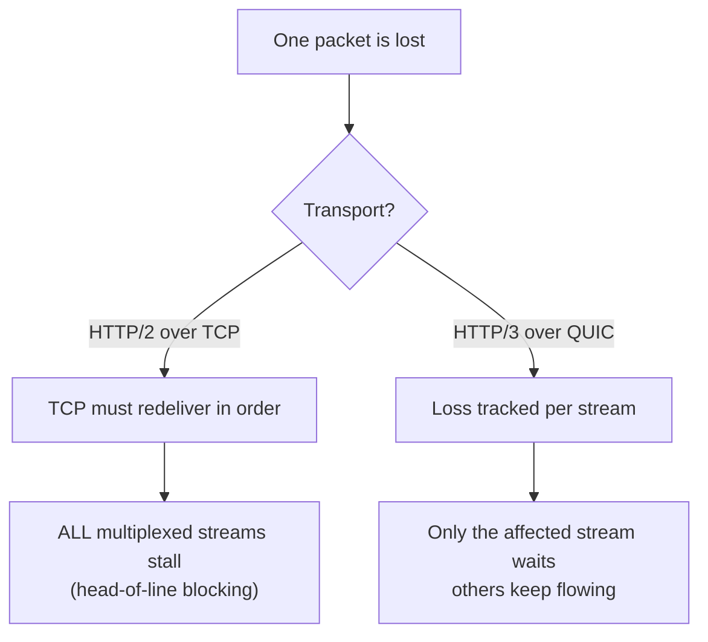
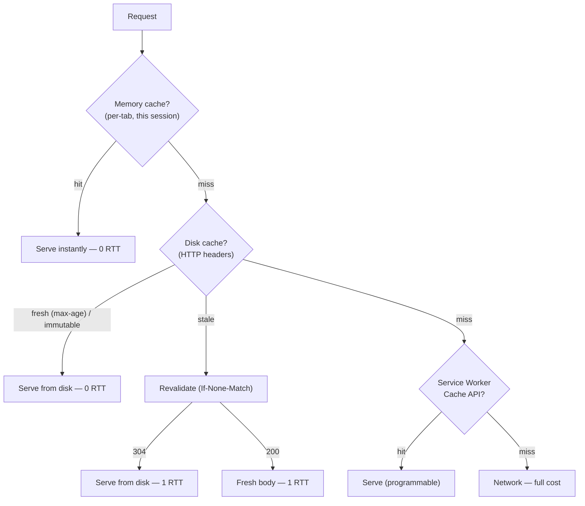

# Module 4: The Network & Execution Bridge

Code execution cannot begin until the browser receives the code. The network layer is the bridge between the server and the runtime. Understanding how bits are delivered, prioritized, and cached is essential for performance engineering.

## 1. The Request Critical Path (Why the First Byte Is Slow)
Before a single byte of your JS arrives, the browser pays for a chain of round trips (RTTs). On a brand-new HTTPS connection over TCP:

* **DNS** resolves the hostname (one RTT, unless cached).
* **[TCP handshake](https://datatracker.ietf.org/doc/html/rfc9293#name-establishing-a-connection)** (SYN / SYN-ACK / ACK) — **1 RTT** to establish the connection.
* **TLS handshake** — TLS 1.2 was 2 RTTs; **[TLS 1.3 is 1 RTT](https://datatracker.ietf.org/doc/html/rfc8446#section-2)** — but it stacks *on top of* TCP. So first-contact HTTPS costs roughly **TCP (1) + TLS 1.3 (1) = 2 RTTs** before any application data.
* **[QUIC (HTTP/3)](https://datatracker.ietf.org/doc/html/rfc9000)** folds the transport and crypto handshakes into **one** combined 1-RTT setup on a *new* connection (versus TCP+TLS 1.3's two); **0-RTT** is the separate resumption case, sending data in the very first packet.

**Concrete math:** on a 50ms-latency link with a *warm DNS cache*, the 2-RTT TLS-over-TCP setup is ~100ms gone *before* the first byte of HTML; cold, add the DNS RTT for ~3 RTT / ~150ms. QUIC's single combined handshake cuts the setup to ~50ms. This is why **`preconnect`** matters: warming DNS+TCP+TLS for an origin you're *about* to hit removes that chain from the critical moment.

*A cold HTTPS connection is three serial round-trips; QUIC folds them into one, and preconnect pays them before you need the byte.*

> **0-RTT caveat:** early data can be **[replayed](https://datatracker.ietf.org/doc/html/rfc8446#section-8)** by an attacker, so it's only safe for **idempotent** requests (a `GET`, not a "transfer funds" `POST`).

## 2. Delivery Protocols (HTTP/1.1 → /2 → /3)
How the browser requests files dictates when the engine can start parsing.

* **HTTP/1.1 bottleneck:** One request/response per connection at a time → **[head-of-line blocking](https://developer.mozilla.org/en-US/docs/Web/HTTP/Guides/Connection_management_in_HTTP_1.x)**; a small script stuck behind a big image. Browsers opened ~6 connections per origin to compensate.
* **[HTTP/2 multiplexing](https://datatracker.ietf.org/doc/html/rfc9113#section-5):** Many concurrent streams over **one** TCP connection. This is what makes shipping 50 small ES modules (Vite dev) viable without per-request overhead.
* **HTTP/3 & QUIC:** HTTP/2 still suffered TCP-level head-of-line blocking — one lost packet stalls *every* stream while TCP retransmits. [HTTP/3 runs over](https://datatracker.ietf.org/doc/html/rfc9114) **QUIC (UDP)** with independent streams: a lost packet stalls only its own stream.

*One lost packet stalls every HTTP/2 stream on the shared TCP connection; HTTP/3 isolates the loss to its own stream.*

<SelfTest>

HTTP/2 multiplexes many streams over one TCP connection, yet a single dropped packet can still stall *all* of them. Why — and why is HTTP/3 immune?

<template #answer>

TCP delivers bytes in strict order, so one lost segment blocks every multiplexed stream until retransmit. QUIC tracks loss per-stream, so only the affected stream waits.

</template>
</SelfTest>

## 3. Resource Hints & Priority
You can tell the browser what to fetch and how urgently.

* **[`preconnect`](https://developer.mozilla.org/en-US/docs/Web/HTML/Reference/Attributes/rel/preconnect) / [`dns-prefetch`](https://developer.mozilla.org/en-US/docs/Web/HTML/Reference/Attributes/rel/dns-prefetch):** Warm the connection (above) to a known origin.
* **[`preload`](https://developer.mozilla.org/en-US/docs/Web/HTML/Reference/Attributes/rel/preload):** Fetch a resource needed *this* navigation at high priority (e.g. a hero font or critical script the parser would discover late).
* **[`modulepreload`](https://developer.mozilla.org/en-US/docs/Web/HTML/Reference/Attributes/rel/modulepreload):** Like `preload` but for ES modules — fetches *and* parses the module graph ahead of need.
* **[`prefetch`](https://developer.mozilla.org/en-US/docs/Web/HTML/Reference/Attributes/rel/prefetch):** Low-priority fetch for the *next* navigation.
* **[`fetchpriority`](https://developer.mozilla.org/en-US/docs/Web/HTML/Reference/Attributes/fetchpriority):** Nudge a resource's priority up or down (e.g. deprioritize a below-the-fold image).

## 4. Caching Is Not One Thing — It's Layers
"Cached" is ambiguous; there are several caches with different rules.

*A request falls through three caches — memory, disk, Service Worker — each with its own lifetime and revalidation rules.*

* **Memory cache:** Per-tab, lives for the page session; instant. (Reused assets may be promoted here for the session — the browser decides heuristically by resource type and reuse likelihood, it's not guaranteed.)
* **Disk (HTTP) cache:** Governed by response headers — [`Cache-Control`](https://developer.mozilla.org/en-US/docs/Web/HTTP/Reference/Headers/Cache-Control)`: max-age`, `ETag` + `If-None-Match` (a 304 saves the body but still costs an RTT), and `immutable`.
* **Service Worker / Cache API:** Programmable, persists across sessions, works offline (below).
* **The pattern that ties to Module 7:** ship content-**hashed** filenames (`app.4f3a.js`) with `Cache-Control: max-age=31536000, immutable`. `immutable` tells the browser **not to revalidate within `max-age`** (so it skips even the 304 round trip), and the hash changes only when content does — so you cache for a year *and* bust precisely. (`immutable` without a long `max-age` does nothing — the two go together.) Compression (`brotli` > `gzip`) shrinks transfer, and since fewer bytes means less to parse, it shortens time-to-execute too.

<SelfTest>

A user reloads and the app is interactive in 200ms with no requests in the Network panel. Which cache layers could be responsible (memory, disk/HTTP, Service Worker), and how do you tell them apart in DevTools? Then: why is a content-hashed `immutable` bundle faster on *repeat* visits than an `ETag`-validated one?

<template #answer>

A 304 still costs a round trip; `immutable` costs zero.

</template>
</SelfTest>

## 5. Service Workers (The Programmable Proxy)
A [Service Worker](https://developer.mozilla.org/en-US/docs/Web/API/Service_Worker_API) is a JS worker between your page and the network, running off the main thread with no DOM access.

* **Request interception:** It listens for the `fetch` event and decides how to answer every request.
* **Offline boot & Cache API:** Serve a cached app shell instantly so the runtime can boot with no network.
* **Stale-While-Revalidate:** Return the cached (stale) asset immediately for instant execution, while fetching a fresh copy in the background for next time.

## 6. Streaming: Where Network Meets Runtime
The boundary between "downloaded" and "executing" is blurrier than it looks.

* **Streaming compilation:** V8 (Module 1) doesn't wait for the whole script. For scripts above a size threshold (on the order of tens of KB — the exact figure is version-dependent) served with a JavaScript MIME type (`text/javascript`), it parses and compiles bytecode **on a background thread as the bytes stream in** — so by the time the download finishes, much of the compile is done.
* **[Streams API](https://developer.mozilla.org/en-US/docs/Web/API/Streams_API) & backpressure:** `fetch().body` is a `ReadableStream`. You can process a response chunk-by-chunk (e.g. parse NDJSON as it arrives) instead of buffering it all — and backpressure lets a slow consumer signal the producer to pause.

## 7. Real-Time Execution Boundaries
Apps don't just load once; they receive continuous data the runtime must process.

* **[WebSockets](https://developer.mozilla.org/en-US/docs/Web/API/WebSockets_API):** Bi-directional, persistent, full-duplex over one connection. The server can push anytime — ideal for collaborative editing or multiplayer (e.g. updating a shared signal in real time, Module 5).
* **[Server-Sent Events (SSE)](https://developer.mozilla.org/en-US/docs/Web/API/Server-sent_events):** Uni-directional text stream over plain HTTP. Simpler than WebSockets, auto-reconnects — perfect for feeds and notification counters.
* **WebRTC:** Peer-to-peer over UDP — two browsers stream audio/video/data directly, the lowest-latency option. (**WebTransport**, over HTTP/3, is the emerging middle ground: low-latency, multiplexed, client-server.)

<SelfTest>

You need to push a live "unread count" from server to client. SSE or WebSocket?

<template #answer>

SSE: it's one-directional server→client, rides plain HTTP/2, and auto-reconnects — a WebSocket's bi-directional full-duplex machinery is wasted complexity here. Reach for WebSocket only when the *client* must also push at high frequency.

</template>
</SelfTest>
