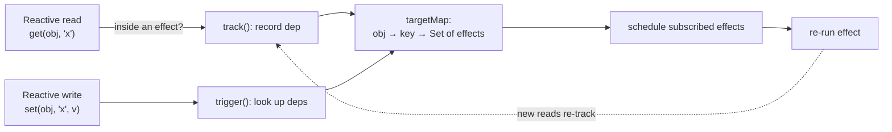
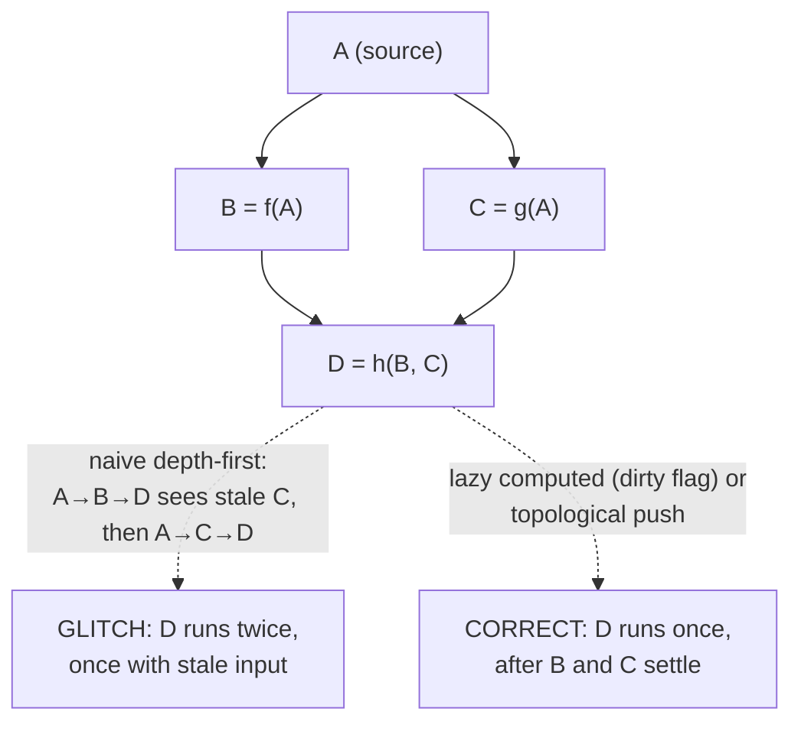
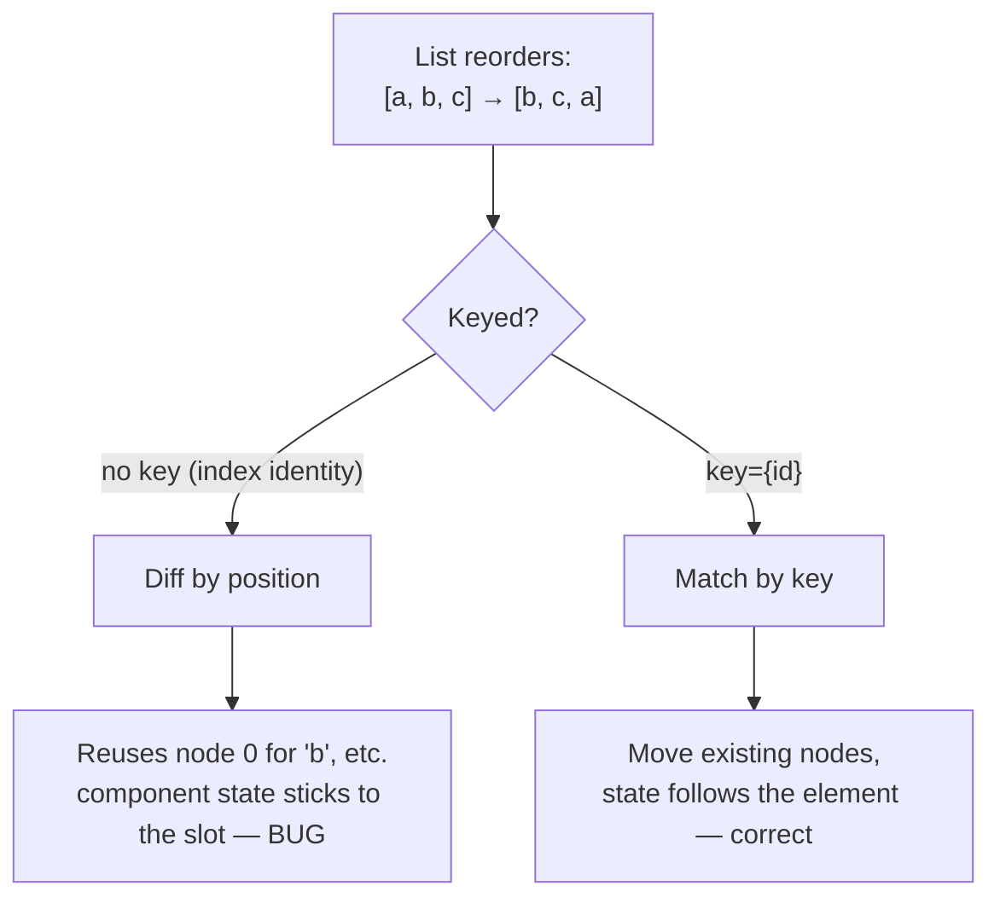

# Module 5: Deep Reactivity Systems

Modern frontend frameworks abstract away manual DOM updates. They use reactivity systems to automatically propagate state changes to the UI. Understanding how these systems work under the hood separates framework users from framework architects.

## 1. Vue Reactivity (Proxies & Observers)
Vue.js uses a [Proxy-based reactivity](https://vuejs.org/guide/extras/reactivity-in-depth.html) engine. When you create a reactive object, Vue wraps it in a `Proxy` that intercepts property access and mutation. The whole system is three functions and one data structure.

* **[`track()`](https://vuejs.org/guide/extras/reactivity-in-depth.html#how-reactivity-works-in-vue)** — called from the `get` trap. Records the currently-running effect as a dependent of `(target, key)`.
* **`trigger()`** — called from the `set` trap. Looks up the effects that depend on `(target, key)` and schedules them to re-run.
* **`effect()`** — runs a function with itself installed as the *active effect*, so any reactive read during that run calls `track()` and subscribes it.

The dependency store is a nested map (see Module 6 for why each layer is the structure it is):

```js
let activeEffect = null
const targetMap = new WeakMap() // target -> key -> Set<runner>

function track(target, key) {
  if (!activeEffect) return
  let deps = targetMap.get(target)
  if (!deps) targetMap.set(target, (deps = new Map()))
  let dep = deps.get(key)
  if (!dep) deps.set(key, (dep = new Set()))
  dep.add(activeEffect)
}
function trigger(target, key) {
  const dep = targetMap.get(target)?.get(key)
  if (!dep) return
  // Iterate a COPY: a sync effect re-runs and re-tracks into
  // `dep`; mutating a Set mid-loop is a footgun. Real Vue does this.
  for (const r of [...dep]) r.scheduler ? r.scheduler() : r()
}
function reactive(obj) {
  return new Proxy(obj, {
    get(t, k, r) {
      track(t, k)
      return Reflect.get(t, k, r)
    },
    set(t, k, v, r) {
      const ok = Reflect.set(t, k, v, r)
      trigger(t, k)
      return ok
    },
  })
}
// Reentrant: save/restore the previous active effect so a
// NESTED effect doesn't clobber its parent's tracking.
// (A bare `activeEffect = null` would break nesting.)
function effect(fn, scheduler) {
  const run = () => {
    const prev = activeEffect
    activeEffect = run
    try { return fn() } finally { activeEffect = prev }
  }
  run.scheduler = scheduler
  run() // run once to collect dependencies
  return run
}
```

That ~25 lines *is* the core idea — and it's reentrant. Real Vue adds the parts that make it correct and fast:

* **[`ref`](https://vuejs.org/api/reactivity-core.html#ref) vs `reactive`:** `reactive()` proxies an object; `ref()` boxes any value in a `{ value }` object so primitives can be tracked too — that's why you write `.value`. Reactivity is **lazy and deep**: nested objects are only wrapped in a `Proxy` the first time you read them, so you don't pay to proxy a tree you never touch.
* **Cleanup & re-tracking:** An effect's dependencies can change between runs (e.g. a `v-if` branch). Real Vue tracks which dep-sets an effect belongs to and *removes it from all of them* before each re-run, then re-collects fresh ones — otherwise a stale dependency would keep re-triggering a now-irrelevant effect. (Module 9 builds this cleanup step explicitly.)
* **Scheduling (batching):** Note that `trigger` calls `r.scheduler()` when present rather than re-running synchronously. Real Vue's scheduler pushes jobs into a queue flushed once on the next microtask ([`nextTick`](https://vuejs.org/api/general.html#nexttick)), de-duplicated — so mutating three properties in one tick re-renders **once**, not three times.

*Reads record the running effect; writes look those effects up and reschedule them — the entire reactivity contract.*



<SelfTest>

The `effect` above saves and restores `activeEffect`. Trace what would break if it used `activeEffect = null` instead, given `effect(() => { state.a; effect(() => state.b); state.c })`.

<template #answer>

The inner effect resets the active effect to null on exit, so `state.c` is read with no active effect — the outer effect never subscribes to `c` and silently stops updating.

</template>
</SelfTest>

## 2. Signals (Fine-Grained Reactivity)
Frameworks like [SolidJS](https://docs.solidjs.com/concepts/intro-to-reactivity) use **signals**: reactive primitives that hold state and track dependencies with no Virtual DOM.

* **Dependency graph:** Signals build an explicit graph. A signal write notifies exactly the computeds/effects subscribed to it — no component re-render, no diff.
* **Fine-grained DOM binding:** Instead of re-running a component, the effect that owns one text node updates *that node*. The component function runs **once**, at setup; only the reactive leaves re-run afterward.

### [`computed`](https://vuejs.org/api/reactivity-core.html#computed): Lazy + Cached (and why it's tricky)
A `computed` must (a) recompute only when a dependency actually changed, and (b) actually *subscribe* to those dependencies. The trick: give its internal effect a **scheduler** that flips a `dirty` flag instead of recomputing eagerly. Recomputation happens lazily, on read:

```js
function computed(getter) {
  let value, dirty = true
  // The effect RUNS the getter, so it reads & subscribes to
  // its deps. The scheduler fires when a dep changes and only
  // marks dirty — deferring the real work until read.
  const runner = effect(getter, () => { dirty = true })
  return {
    get value() {
      // recompute on demand
      if (dirty) { value = runner(); dirty = false }
      return value
    },
  }
}
```

The earlier-broken version is the classic mistake: an effect body that only sets `dirty = true` never *reads* the getter, so it subscribes to nothing and the value freezes after the first read. The getter must run inside the tracked effect.

A computed is also a dependency *itself* — and that's the half that makes diamonds correct. Add a `track`-on-read so a downstream effect subscribes to the computed, and re-trigger that dep in the scheduler:

```js
get value() {
  track(this, "value") // downstream effects subscribe here
  if (dirty) { value = runner(); dirty = false }
  return value
}
// scheduler becomes:
//   () => { dirty = true; trigger(this, "value") }
```

Now `D` reading two computeds re-runs only after both have re-triggered — the propagation chain stays intact.

### The Glitch (Diamond) Problem
If `C` and `B` both derive from a root `A`, and `D` derives from both, naive propagation can compute `D` twice — once with a *stale* input (a visible "glitch").

```
    ┌─→ B ─┐
A ──┤      ├─→ D
    └─→ C ─┘
```

Propagate depth-first and `A→B→D` runs `D` with the new `B` but the *old* `C`; then `A→C→D` runs it again — the first run was the glitch. Solutions: make computeds **lazy** (pull on read, with the `dirty` flag above) and/or propagate in **topological order** so `D` only recomputes after *both* `B` and `C` are settled — exactly once, never with a stale input.

*A diamond dependency makes naive propagation run the sink twice with a stale input; lazy or topological evaluation runs it once.*



## 3. The Virtual DOM (React)
React doesn't track individual property reads. When state changes, it **re-renders** the component (and, by default, its children) into a new VDOM tree, then diffs.

* **[Render vs. commit](https://react.dev/learn/render-and-commit):** *Render* builds the new element tree and diffs it against the current one (interruptible in Concurrent React). *Commit* applies the minimal DOM mutations synchronously.
* **Tree diffing:** Comparing two arbitrary trees is **O(n³)** (general tree-edit distance: each node in one tree can map to any node in the other, plus insert/delete bookkeeping). React assumes (a) different element *types* produce different trees and (b) `key`s identify stable children, collapsing it to **O(n)**.
* **Where intuition breaks:** That first heuristic has a sharp edge — if an element's *type* changes (`<div>`→`<span>`, or a different component), React **throws away the entire subtree and its state** rather than diffing into it. A conditionally-swapped wrapper silently resets all child state below it.
* **[Keyed reconciliation](https://react.dev/learn/rendering-lists#keeping-list-items-in-order-with-key):** `key` lets the diff match old children to new ones across reorders, so it moves nodes instead of destroying and recreating them. A bad key (like array index on a reorderable list) defeats this and silently corrupts component state.

*Without keys the diff matches by position and state sticks to the slot; keys make state follow the element through a reorder.*



* **Why children re-render:** A parent re-render re-renders children unless you memoize ([`React.memo`](https://react.dev/reference/react/memo), stable props). This is the central cost VDOM frameworks fight — and exactly the cost signals avoid by construction.

## 4. Compiler-Driven Reactivity (Svelte / Vue Vapor)
[Svelte](https://svelte.dev/docs/svelte/what-are-runes) shifts reactivity work from the browser to the build step.

* **AST transforms:** The compiler parses `.svelte` files into an AST (see Module 7).
* **Compile-time dependency analysis:** Instead of a runtime Proxy or VDOM, the compiler determines *at build time* which DOM updates each assignment triggers, and emits surgical instructions. There's no diff and no Proxy — just a direct write:

```svelte
<!-- you write -->
<h1>{count}</h1>

<!-- compiler emits (sketch) -->
let count = 0
h1.textContent = count        // initial render
function update() {           // re-run on change
  if (dirty.count) h1.textContent = count
}
```

The reactivity is the generated `update()`, not a runtime observer.
* **The tradeoff:** Less shipped runtime and no per-update diff cost, but reactivity is bounded by what the compiler can statically see. (Vue's experimental *[Vapor mode](https://github.com/vuejs/core-vapor)* applies the same idea to Vue's reactivity.)

<SelfTest>

Three architectures, one question: when state changes, **what runs?**

<template #answer>

VDOM (React): the component function and its children, then a diff. Signals (Solid): only the specific effects subscribed to that signal. Compiled (Svelte): the exact DOM-write statements the compiler emitted for that variable. Name which pays at runtime vs. build time, and where each one's cost scales with component *size* vs. number of *changed values*.

</template>
</SelfTest>