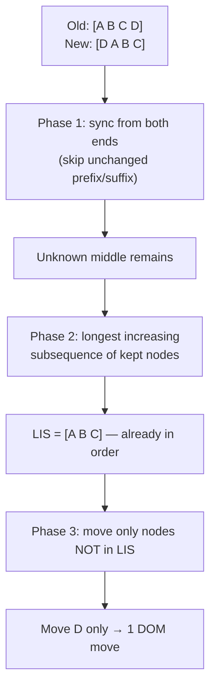

# Module 6: Practical Data Structures & Algorithms

Forget the whiteboard interview questions. In the context of browser and framework execution, data structures are pragmatic tools chosen to solve specific performance and memory problems. Every choice below is taken from real framework source.

## 1. Trees & the Keyed Diff (Virtual DOM)
The DOM is hierarchical, so any Virtual DOM representation is a tree. Each node holds its type, props, children, and text.

* **Why O(n) not O(n³):** General tree-edit distance is O(n³). Frameworks cheat with heuristics — same position + same type = reuse; `key` identifies stable children — to get linear diffing fast enough for 60 FPS (the type-change failure mode is in Module 5).
* **The actual algorithm (Vue):** Vue's [`patchKeyedChildren`](https://github.com/vuejs/core/blob/main/packages/runtime-core/src/renderer.ts) first runs cheap **two-ended fast paths** — syncing matching nodes inward from the start and from the end — which handles the common append/prepend/replace cases in O(n). Only for the *unknown middle* that's left does it compute the **Longest Increasing Subsequence** of the nodes that kept their relative order, and move only the nodes *not* in that subsequence. The LIS step is real O(n log n) (patience sorting), lifted straight from `runtime-core`, and it minimizes DOM moves — the most expensive operation.

*Trim the matching ends, then move only the nodes outside the longest increasing subsequence — the minimum DOM moves.*



> **Self-Test:**
> A list reorders from `[A B C D]` to `[D A B C]`. A naive keyed diff moves three nodes. Why does an LIS-based diff move only **one** (`D`), and what is the "increasing subsequence" here? (`A B C` keep their relative order — that's the LIS — so only `D` is relocated.)

## 2. Hash Maps, WeakMaps & the Cost of Dictionary Mode
Reactivity needs to associate objects with their subscribers without leaking memory.

* **The leak:** A plain `Map<object, subscribers>` holds a **strong** key reference. The object stays alive as long as the framework's map does — a guaranteed leak when the UI discards it.
* **The fix — [`WeakMap`](https://developer.mozilla.org/en-US/docs/Web/JavaScript/Reference/Global_Objects/WeakMap):** Keys are held **weakly**. When the object is otherwise unreachable, the GC reclaims it *and* drops the entry silently. This is why Vue's dep store is `WeakMap<target, Map<key, Set<effect>>>` — `WeakMap` for the lifecycle, [`Map`](https://developer.mozilla.org/en-US/docs/Web/JavaScript/Reference/Global_Objects/Map) for ordered string keys, [`Set`](https://developer.mozilla.org/en-US/docs/Web/JavaScript/Reference/Global_Objects/Set) for de-duplicated subscribers.
* **The hidden cost in V8:** Objects normally use fast *hidden classes* (Module 1). Push an object into a dynamic-dictionary usage pattern and V8 demotes it to **dictionary mode** (a real hash table), losing inline caching. The single most common trigger is [`delete`](https://developer.mozilla.org/en-US/docs/Web/JavaScript/Reference/Operators/delete):

```js
const o = { a: 1, b: 2, c: 3 }
// commonly demotes o to dictionary mode;
// subsequent reads can lose the IC fast path
delete o.b
```

(V8 doesn't demote on *every* `delete` — deleting the last property, or an already-slow object, differs — but mid-object `delete` is the classic trigger.)

If you need a true dynamic key→value store, use `Map`; it's built for it and won't deopt your object shapes.

## 3. Linked Lists vs. Heaps (Scheduling) — A Precision Point
A common claim is "schedulers use linked lists." Reality in React is more interesting, and the distinction matters.

* **The [Fiber](https://github.com/facebook/react/blob/main/packages/react-reconciler/src/ReactFiber.js) tree is a linked list:** Each fiber links to its first `child`, next `sibling`, and `return` (parent). Flattening the tree into pointer-chained nodes lets React **pause, resume, and abort** traversal mid-render — impossible with a recursive call stack. This is the structure behind interruptible rendering.
* **The task scheduler is a min-heap:** React's [`scheduler`](https://github.com/facebook/react/blob/main/packages/scheduler/src/forks/Scheduler.js) package keeps pending tasks in a **binary min-heap** ordered by priority/expiration. A heap gives **O(log n) insert** *and* O(1) peek-min together. A *sorted* linked list also peeks in O(1) — but pays O(n) per insertion to stay sorted; an *unsorted* list peeks in O(n). The heap wins because it balances both operations, which is exactly what a churning task queue needs.
* **Linked lists still win** where you only ever push/pop at the ends and need O(1) splicing without reindexing an array — exactly the effect/update queues frameworks flush each tick.

## 4. Bitmasks (React Lanes)
Sometimes the optimal structure is an integer. React encodes update priority as **[lanes](https://github.com/facebook/react/blob/main/packages/react-reconciler/src/ReactFiberLane.js)** — a single **[32-bit signed integer](https://tc39.es/ecma262/#sec-toint32)** carrying **31 distinct lanes** (sync, transition, idle, etc.) in bits 0–30, with the sign bit deliberately left unused.

* **Why 31 lanes, not 32:** JS bitwise operators coerce operands to **32-bit signed** integers, and V8 keeps small integers as SMIs (Module 1). Confining lanes to bits 0–30 keeps every mask a *positive* value, avoiding the sign bit (bit 31) and the deopt of spilling to a HeapNumber.
* **Why a bitmask at all:** Membership, union, and intersection of priority sets become single [bitwise ops](https://developer.mozilla.org/en-US/docs/Web/JavaScript/Reference/Operators/Bitwise_AND) (`&`, `|`). "Does this work include any high-priority lane?" is one AND, not a set traversal.
* **The lesson:** when a set is small and fixed, a bitmask beats every fancier structure on both speed and memory.

## 5. Tries / Radix Trees (Routing)
How does a router match `/users/42/posts` against hundreds of route patterns without testing each one?

* **Radix tree:** Routes are stored as a compressed prefix tree. Matching walks the URL segment by segment, so lookup cost scales with the *path depth*, not the *number of routes*. This is how high-performance routers (e.g. [`find-my-way`](https://github.com/delvedor/find-my-way), used by Fastify) and modern framework routers stay fast as route tables grow.

> **Self-Test:**
> You have 5,000 registered routes. With a linear list of regexes, matching one URL is O(routes). With a radix tree it's O(path segments). For `/a/b/c`, roughly how many node comparisons does the radix tree do — and why doesn't adding the 5,001st route change that number?

## 6. Graphs (Dependency Propagation)
Signals and fine-grained reactivity (Module 5) form **Directed Acyclic Graphs**.

* **Nodes & edges:** Signals and computeds are nodes; "reads from" relationships are edges.
* **Topological propagation:** When a root signal changes, the system must update a computed only **after** all of its upstream inputs are settled — otherwise it produces a *glitch* (the diamond problem from Module 5). Topological ordering, dirty-flagging, and lazy pull-on-read are the three tools that prevent it.

> **Self-Test:**
> In the diamond `A → {B, C} → D`, you update `A`. Which traversal order guarantees `D` computes exactly once with both fresh inputs — depth-first or a topological sort that defers `D` until both `B` and `C` are marked clean? Why does naive DFS double-compute `D`?

## Synthesis: Structure ↔ Subsystem
Each structure was chosen for the one operation it makes cheap:

| Structure | Cheap op | Expensive op | Chosen by |
| :--- | :--- | :--- | :--- |
| Array | random access O(1) | front-insert O(n) | rendered slices |
| Linked list | end splice O(1) | search O(n) | Fiber tree, flush queues |
| Min-heap | peek-min O(1), insert O(log n) | arbitrary search O(n) | React scheduler |
| Hash map | lookup O(1) | ordered iteration | dep stores (`Map`) |
| WeakMap | lookup + auto-GC | (no iteration) | Vue target→deps |
| Bitmask | set algebra O(1) | >31 members | React lanes |
| Radix tree | prefix match O(depth) | fuzzy match | routers |

The meta-skill: when you see a framework reach for a structure, ask *which operation is on its hot path* — that's always the answer to "why this one."