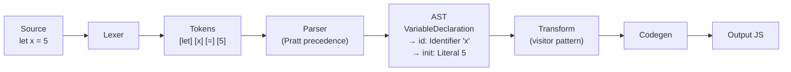
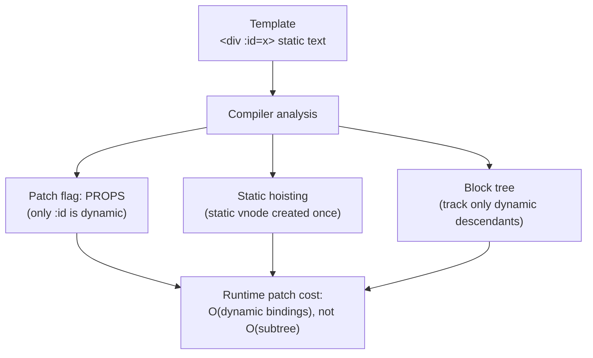

# Module 7: Code as Data (Compilers & ASTs)

Most frontend developers treat Babel, Vite, esbuild, and the Vue/Svelte compilers as black boxes. To understand how your code becomes execution, you must understand compilers — and the central idea that **code is just data you can restructure.**

## 1. Parsing: From Text to Trees
Your JavaScript or template is a giant string. Turning it into something executable happens in two stages.

*Source becomes tokens, tokens become a tree, the tree is transformed, then code is regenerated — compilation as data transformation.*



* **Lexing (tokenization):** Scan characters into tokens — `Keyword(let)`, `Identifier(x)`, `Punctuator(=)`, `Numeric(5)`. This throws away whitespace and comments and yields a flat stream.
* **Parsing:** Arrange tokens into an **[Abstract Syntax Tree](https://github.com/estree/estree)** per the language grammar. `let x = 5` becomes (a *simplified* [ESTree](https://github.com/estree/estree/blob/master/es5.md) shape — real nodes from [acorn](https://github.com/acornjs/acorn)/espree also carry `start`/`end`/`loc`, wrapped in a top-level `Program` node):

```js
{ type: "VariableDeclaration", kind: "let",
  declarations: [{ type: "VariableDeclarator",
    id:   { type: "Identifier", name: "x" },
    init: { type: "Literal", value: 5 } }] }
```

* **How expression precedence is actually handled:** A recursive-descent parser *can* encode precedence, but needs roughly one grammar rule (and one function) per precedence level — a tall cascade for a language with ~20 levels. **Pratt parsing** (operator-precedence / "binding power") collapses that: each operator carries a binding strength, and the parser greedily consumes a right operand only while the next operator binds *tighter*. One loop handles all levels, plus prefix and right-associative operators uniformly. That's the mechanism that makes `*` grab its neighbors before `+`.

<SelfTest>

How does `<div>{{ message }}</div>` become executable JavaScript?

<template #answer>

The template compiler lexes it into tokens (`tagOpen`, `interpolation`, `tagClose`), parses that into a template AST, then *generates* a render function: roughly `createElementVNode("div", null, toDisplayString(ctx.message))`. The braces aren't magic — they're a node type the compiler knows how to emit code for.

</template>
</SelfTest>

## 2. AST Transforms & the Visitor Pattern
Once code is an AST, it's a data structure you can walk and rewrite.

* **The visitor pattern:** Tools like [Babel](https://babeljs.io/docs/)/[SWC](https://swc.rs/docs/getting-started) [traverse the tree](https://github.com/jamiebuilds/babel-handbook/blob/master/translations/en/plugin-handbook.md#visitors) depth-first, calling a handler on **enter** and **exit** of each node type. You get a `path` (the node plus its parent links and **scope**/binding info), and you mutate through it — replace a node, insert a sibling, rename a binding. Scope tracking is what lets a transform rename a variable safely without clobbering an unrelated one of the same name.
* **Babel in one sentence:** parse modern syntax (e.g. [optional chaining](https://tc39.es/ecma262/#sec-optional-chains) `?.`) → find those nodes → replace them with equivalent older-syntax nodes → regenerate.

<SelfTest>

A transform renames every top-level `const x` to `const _x`. Why does it *need* the path's scope/binding information rather than a string find-replace on `x`?

<template #answer>

A blind rename clobbers an unrelated `x` in a nested function, a property key `obj.x`, or a string `"x"`; only binding info knows which identifiers actually *refer to* that declaration.

</template>
</SelfTest>

<SelfTest variant="run">

Open [astexplorer.net](https://astexplorer.net) (parser: `@babel/parser`) and paste `a?.b.c`. Predict first: is the whole expression one node or a nested tree — and which link carries the `optional` flag?

<template #answer>

A **left-nested tree**, not one node: an `OptionalMemberExpression` for `.c` whose `object` is another `OptionalMemberExpression` for `a?.b`. Only the `?.` link is `optional: true`; `.c` is `optional: false`. The short-circuit ("if `a` is nullish the whole chain yields `undefined`") is *semantics* layered on that tree — the parser only records which link was optional. Watching flat surface syntax become a nested node structure is exactly §2's point: transforms operate on the tree, never the text.

</template>
</SelfTest>

## 3. Static Analysis: Tree Shaking (and Why It's Subtle)
Compilers don't just transform; they analyze to *remove* code.

* **Why ESM is shakeable and CommonJS is not:** [`import`/`export`](https://developer.mozilla.org/en-US/docs/Web/JavaScript/Guide/Modules) are **static** — bindings are known before the code runs, so a bundler can build an exact import/export graph and drop unreferenced exports. `require()` is a dynamic function call; its target can be computed at runtime, so the analysis can't prove an export is dead.
* **The side-effect problem:** A bundler can't drop `import './polyfill'` even if nothing's imported from it — the module might mutate globals. So it must be *told* what's safe: [`"sideEffects": false`](https://rollupjs.org/configuration-options/#treeshake-modulesideeffects) in `package.json`, and [`/*#__PURE__*/`](https://rollupjs.org/configuration-options/#treeshake-annotations) annotations. That annotation marks a specific **call or `new` expression** as side-effect-free, so the bundler may drop it *if its result is unused* — it doesn't make arbitrary code removable. (It's a *promise* the bundler trusts: if the call's arguments themselves have side effects, a misapplied `/*#__PURE__*/` silently drops them — a real bug class.) Without these hints, "dead" code survives because the compiler is (correctly) conservative.

<SelfTest>

A utility library is authored in ESM with named exports, yet importing one function still pulls in the whole bundle. Name two likely causes.

<template #answer>

1) Missing `"sideEffects": false`, so the bundler assumes module-level side effects; 2) the package actually ships **CommonJS** — `require`-based, so its exports can't be statically proven dead. Re-exporting through a CJS barrel file defeats shaking the same way.

</template>
</SelfTest>

## 4. The Optimizing Template Compiler (Vue)
A framework compiler can do far more than emit a render function — it can encode *runtime hints* that make diffing cheaper.

* **Patch flags:** When Vue compiles `<div :id="x">static</div>`, it tags the vnode with a bitmask (e.g. `PROPS`) saying "only the `id` can change." At runtime the diff **skips** the static children entirely and patches just the dynamic binding — turning a tree walk into a targeted update.
* **Static hoisting:** Nodes with no dynamic bindings are created **once**, outside the render function, and reused every render instead of being recreated.
* **Block tree:** The generated render function wraps the root in [`(openBlock(), createElementBlock(...))`](https://vuejs.org/guide/extras/rendering-mechanism.html#compiler-informed-virtual-dom); the block collects its dynamic descendants into a flat `dynamicChildren` array, so diffing iterates a short list of things-that-can-change instead of recursing the whole subtree. Structural directives (`v-if`, `v-for`) open **nested blocks**, because they're the boundaries where the set of dynamic nodes can change shape — so each becomes its own independently-tracked block. (Anchor these claims in real Vue source: `openBlock`, `createElementBlock`, and the `PatchFlags` enum in `@vue/runtime-core` / `@vue/shared`.)

*Compile-time analysis shrinks runtime patching from the whole subtree down to just the dynamic bindings.*



This is the throughline of Modules 3–5: **the more the compiler knows statically, the less the runtime has to do.**

<SelfTest>

Why can a patch flag turn an O(nodes-in-subtree) diff into O(dynamic-bindings)?

<template #answer>

The flag tells the runtime *exactly* which props/children are dynamic, so it skips the entire static remainder instead of walking and comparing it — the compiler already proved it can't change.

</template>
</SelfTest>

## 5. Code Generation & Source Maps
* **Codegen:** Walk the final AST and print it back to a string — the executable JS shipped to the browser.
* **Source maps:** Because the shipped code barely resembles your source, the compiler emits a `.map` file. Its `mappings` field is **not** absolute coordinates — it's a string of **[VLQ-encoded](https://tc39.es/ecma426/) relative deltas**: segments separated by `,`, generated lines by `;`, and each segment encodes the *change since the previous segment* in (generated column, source index, original line, original column, name index). One non-obvious detail: the **generated-column field resets to 0 at each new line** (`;`), while the other four fields delta **continuously across the entire file**. Delta encoding is exactly why the file stays small. DevTools sums the deltas to recover real positions and show your source on a breakpoint.
* **Why esbuild/SWC are fast:** [written in Go/Rust](https://esbuild.github.io/faq/#why-is-esbuild-fast), they parallelize across cores and do the whole pipeline in as few AST passes as possible — versus JS-based toolchains that re-traverse the tree many times. (More on judging this in Module 11.)