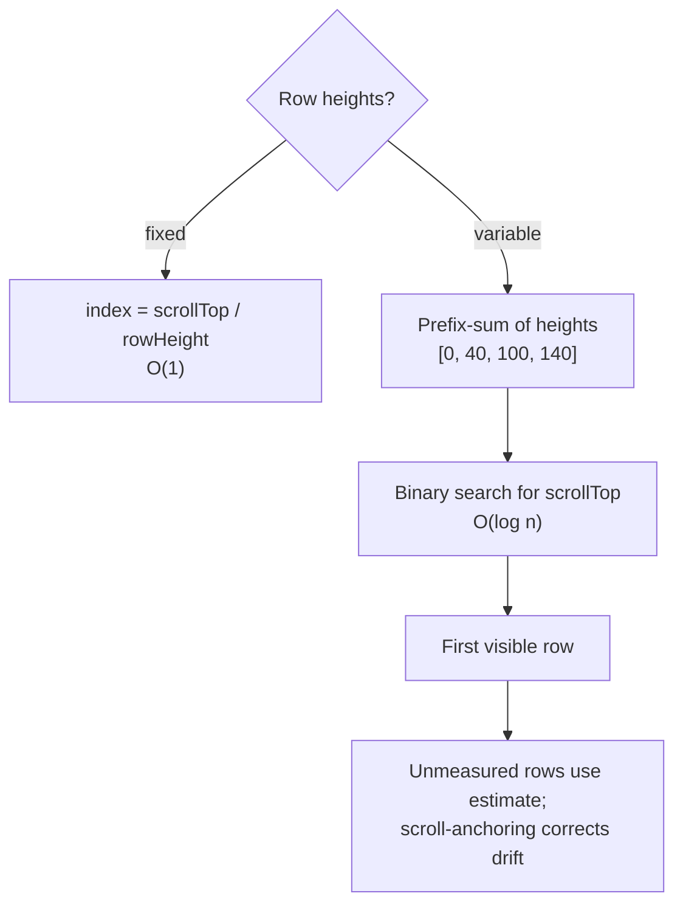
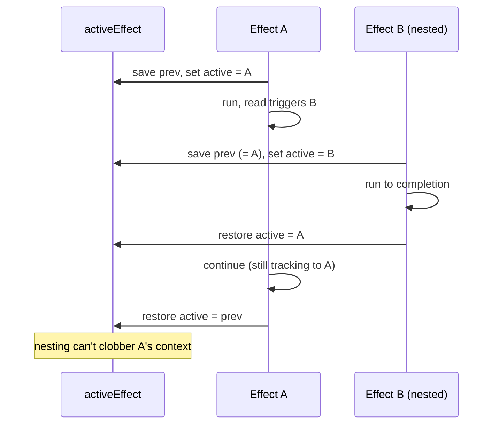

# Module 9: Build Difficult Things from Scratch

Reading source code is excellent, but true mastery requires implementation. You don't truly understand a complex system until you've built it and hit the exact brick walls the original authors faced. Each project below names that wall — the non-obvious problem that *is* the lesson.

## 1. The Virtual Scroller
Rendering 100,000 rows crashes the browser. A virtual scroller renders only what's in the viewport plus a small buffer.

* **Fixed-height math (the easy 80%):**
  ```js
  const first = Math.floor(scrollTop / rowHeight)
  const visible = Math.ceil(viewportHeight / rowHeight)
  const start = Math.max(0, first - BUFFER)
  const end = Math.min(totalCount, first + visible + BUFFER) // clamp!
  // spacer height = totalCount * rowHeight
  // offset the rendered slice by start * rowHeight
  ```
  Clamping matters: an unclamped `end` renders phantom rows past the data, and an unclamped `start` renders negative indices at the top.
* **DOM recycling:** Don't create/destroy nodes as you scroll — keep a fixed pool and reposition it with [`transform: translateY(...)`](https://developer.mozilla.org/en-US/docs/Web/CSS/transform) (a compositor-only move; see Module 2).
* **The brick wall — variable heights:** The instant rows differ in height you can't compute `first` by division. You need a **measurement cache** of actual heights, an *estimated* height for unmeasured rows, and a **scroll-anchoring** step that corrects `scrollTop` after a measured row turns out taller/shorter than estimated — or the list jumps under the user's finger.

> **Self-Test:**
> With fixed heights the spacer is `totalCount * rowHeight`. With variable heights, what replaces that single multiply? You build a *prefix-sum* (cumulative offset) array: reading row N's offset is then O(1), but finding *which* row sits at a given `scrollTop` becomes a **binary search** over that array — O(log n), not the O(1) division you had with fixed heights. Naming both costs is the point.

*Fixed rows are O(1) division; variable rows need a prefix-sum plus binary search to find the first visible row in O(log n).*



## 2. A Custom Reactive Engine
Rebuild the core of Module 5 yourself — including the two things that make it actually correct: reentrancy and cleanup.

```js
let active = null
function signal(value) {
  const subs = new Set()
  return {
    get() {
      // two-way link (so cleanup can find this set later)
      if (active) { subs.add(active); active.deps.add(subs) }
      return value
    },
    set(v) { value = v; [...subs].forEach((e) => e.run()) },
  }
}
function effect(fn) {
  const e = {
    deps: new Set(), // every subs-set this effect is in
    run() {
      // CLEANUP: drop stale subscriptions before re-tracking
      for (const dep of e.deps) dep.delete(e)
      e.deps.clear()
      const prev = active // SAVE/RESTORE: survive nesting
      active = e
      try { fn() } finally { active = prev }
    },
  }
  e.run()
  return e
}
```

*Saving and restoring the active effect around a nested run keeps the outer effect's tracking context intact.*



* **`computed(fn)`:** Derived signal that caches and only recomputes when a dependency changed — implement the `dirty` flag + scheduler from Module 5.
* **Why cleanup needs `e.deps`:** an effect can't reach a signal's private `subs` set directly. The fix is the **two-way link** above — when a signal is read, it adds the effect to its `subs` *and* records itself on the effect's `deps`. Now `run()` can walk `e.deps` and unsubscribe before re-tracking. Without it, an effect that conditionally reads a signal keeps a stale subscription forever. This single problem is why real reactivity is more than 15 lines.
* **Re-entrancy caveat (the same wall as the store below):** `set` runs subscribers *synchronously*. If an effect writes a signal it also reads, it re-triggers itself — and without a scheduler that's an infinite loop. Iterate a snapshot (`[...subs]`) so you don't mutate the set mid-flush, and in a real engine route re-runs through a batched scheduler (Module 5) rather than calling `run()` inline.

## 3. A Mini Component Framework
Combine your reactive engine with DOM updates to render a `<Counter />`.

* **Template compilation:** Parse `Counter: {{ count }}`, locate the `{{ }}` binding sites, and remember which text node each maps to.
* **DOM patching:** Wrap each binding in an `effect` that writes the exact `TextNode.nodeValue` — never by re-serializing the whole parent's markup. When `count` changes, only that one text node updates.
* **The brick wall — first render vs. update:** You'll be tempted to write one code path. Keep *mount* (create nodes, attach effects) and *patch* (effects fire, nodes mutate) distinct, or you'll re-create the DOM on every change and lose focus/selection state.

> **Self-Test:**
> Your `effect` writes `node.nodeValue = count`. What happens to the user's text cursor / IME composition if you instead re-render by reassigning the parent's whole markup string? (The node is destroyed and recreated, so focus and selection are lost — the reason fine-grained text patching exists.)

## 4. State Management System
Build a global store like Pinia or Redux.

* **Subscriptions:** Components across the tree subscribe to slices of external state.
* **Persistence:** Hydrate initial state from (and write changes back to) [`localStorage`](https://developer.mozilla.org/en-US/docs/Web/API/Window/localStorage)/[`IndexedDB`](https://developer.mozilla.org/en-US/docs/Web/API/IndexedDB_API) — the wall here is *when* to serialize (debounced, not every mutation) and how to avoid persisting derived/transient fields.
* **The brick wall — batching:** A handler that mutates three fields synchronously must re-render **once**. Queue invalidated subscribers in a `Set` (auto-dedup) and flush on the next microtask ([`queueMicrotask`](https://developer.mozilla.org/en-US/docs/Web/API/queueMicrotask)) — the same scheduler pattern Vue uses for [`nextTick`](https://vuejs.org/api/general.html#nexttick) (Module 5).

```js
const dirty = new Set(); let scheduled = false
function invalidate(sub) {
  dirty.add(sub)
  if (!scheduled) { scheduled = true; queueMicrotask(flush) }
}
function flush() {
  scheduled = false
  const q = [...dirty]; dirty.clear() // snapshot, THEN clear
  q.forEach((s) => s())
}
```

* **The re-entrancy caveat:** snapshot the queue (`[...dirty]`) *before* clearing, or a subscriber that calls `invalidate` during the flush mutates the set you're iterating. With the snapshot, such re-entrant invalidations land in a *fresh* batch and schedule another microtask — correct, not lost.

> **Self-Test:**
> A click handler does `count++; count++; count++`. With the batching above, how many times does a subscriber run, and on which turn of the event loop? (Once, on the next microtask — the `Set` dedups the three invalidations of the same subscriber.)

## 5. A Simplified Bundler (Like Vite Dev)
Browsers support ES modules ([`<script type="module">`](https://developer.mozilla.org/en-US/docs/Web/HTML/Reference/Elements/script/type#module)) but choke on [bare imports](https://developer.mozilla.org/en-US/docs/Web/HTML/Reference/Elements/script/type/importmap) like `import React from 'react'`.

* **Module resolution:** Run a local server that intercepts requests for `.js`, parses each file to find its imports (Module 7), and **rewrites** bare specifiers to real URLs (`'react'` → `/@modules/react`), serving the resolved file from `node_modules`.
* **The brick wall — the dependency graph & HMR:** To support hot updates you must track *who imports whom*. When a file changes you walk that graph to find the smallest set of modules to re-send, and [push an invalidation over a WebSocket](https://vite.dev/guide/api-hmr.html) (Module 4) — instead of reloading the page. Building the graph is the real work; rewriting imports is the easy part.

> **Self-Test:**
> File `b.js` is imported by `a.js` and `c.js`. You edit `b.js`. Why does HMR need the *reverse* edges (importers), not the forward ones (imports), to know which modules to invalidate — and what stops the invalidation from cascading to the whole graph? *(You walk importers upward to find who's affected; the cascade stops at the first module that declares an HMR boundary — [`import.meta.hot.accept()`](https://vite.dev/guide/api-hmr.html#hot-accept-cb) — which says "I can swap my dependency in place, don't propagate past me." With no accepting boundary, it bubbles to the root and falls back to a full reload.)*

> **Cross-project synthesis:** The same two patterns recur in all five: a **pool/cache to avoid re-creating expensive things** (DOM nodes, computed values, parsed modules) and a **microtask-batched flush to coalesce work** (renders, store updates). Spotting them is the point of building these.
